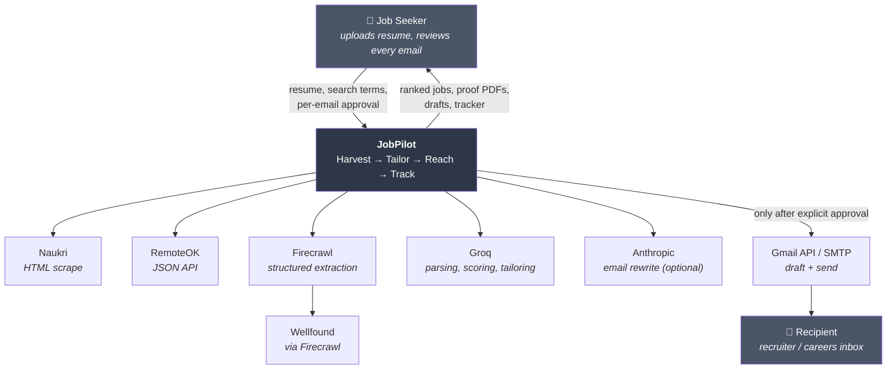
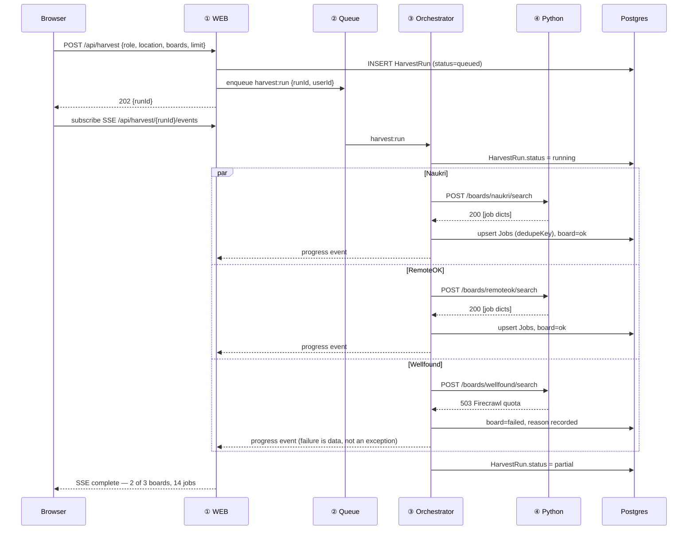
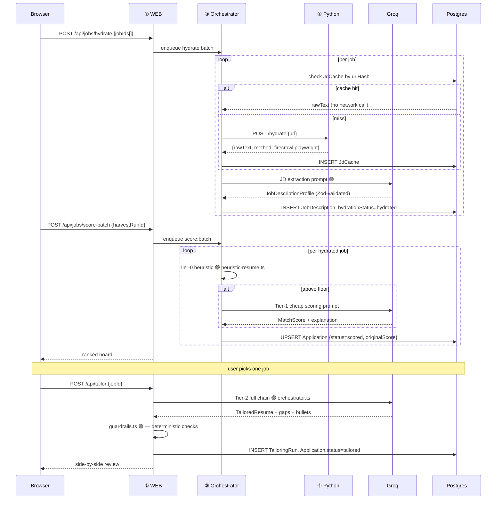
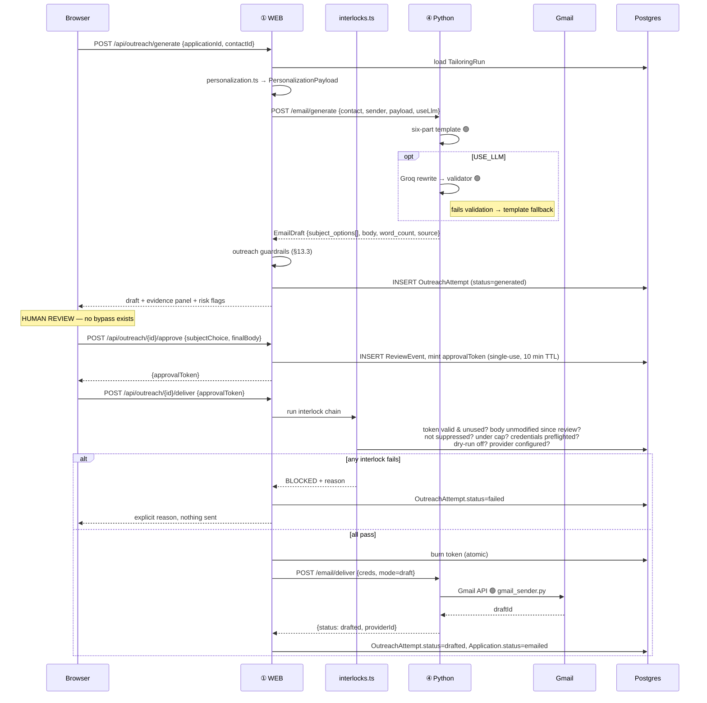
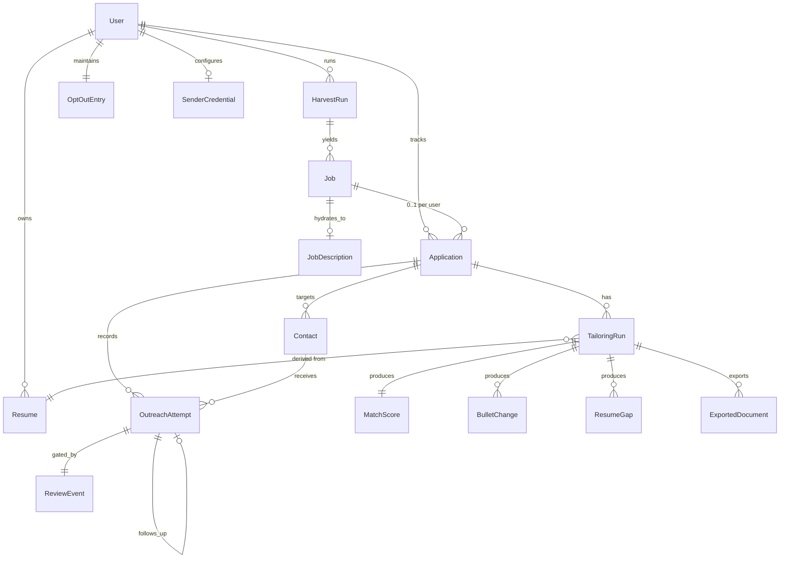

# JobPilot — System Architecture

**Companion to:** [`problemStatement.md`](./problemStatement.md)
**Status:** Design. Nothing here is built yet; the three source projects exist and are referenced as-is.
**Audience:** whoever implements the merge — including future you.

---

## Table of Contents

1. [Scope and Reading Order](#1-scope-and-reading-order)
2. [Architectural Principles](#2-architectural-principles)
3. [System Context (C4 L1)](#3-system-context-c4-l1)
4. [Container View (C4 L2)](#4-container-view-c4-l2)
5. [Component View (C4 L3)](#5-component-view-c4-l3)
6. [Runtime Flows](#6-runtime-flows)
7. [Data Architecture](#7-data-architecture)
8. [The Schema Contract (Zod ↔ Pydantic)](#8-the-schema-contract-zod--pydantic)
9. [API Contract](#9-api-contract)
10. [Queue and Background Work](#10-queue-and-background-work)
11. [Scraping Subsystem](#11-scraping-subsystem)
12. [LLM Subsystem](#12-llm-subsystem)
13. [Guardrail Architecture](#13-guardrail-architecture)
14. [Outreach and Delivery Subsystem](#14-outreach-and-delivery-subsystem)
15. [Security Architecture](#15-security-architecture)
16. [Observability](#16-observability)
17. [Deployment Topology](#17-deployment-topology)
18. [Failure Modes and Degradation](#18-failure-modes-and-degradation)
19. [Testing Strategy](#19-testing-strategy)
20. [Architecture Decision Records](#20-architecture-decision-records)
21. [Migration Map](#21-migration-map)
22. [Open Questions](#22-open-questions)

---

## 1. Scope and Reading Order

This document specifies **how** JobPilot is built. The problem statement specifies **what** and **why**.

Three sections carry most of the load and should be read first:

- **§4 Container View** — the deployable units and why there are exactly four.
- **§7 Data Architecture** — the schema that replaces three incompatible vocabularies.
- **§20 ADRs** — the decisions that everything else follows from. If you disagree with the architecture, disagree here.

Throughout, code is marked with its provenance:

| Marker | Meaning |
|--------|---------|
| 🟢 **EXISTING** | Carried over from a source repo, called unchanged |
| 🟡 **ADAPTED** | Source code with its I/O boundary changed (CLI → function, session → DB) |
| 🔴 **NEW** | Written for the platform |

---

## 2. Architectural Principles

These are inherited from the three source projects and extended. Every design decision below traces back to one of them.

### P1 — Truthfulness is enforced by code, not by prompts
*Inherited from Resume Shapeshifter.* Prompt instructions are the first layer, never the only one. Deterministic post-generation checks (`lib/guardrails.ts`) run on every LLM output, and they run **server-side** where the client cannot skip them. Extended in JobPilot: the same contract now covers outreach copy, not just resume bullets (§13).

### P2 — Human gates are structural, not UI conventions
*Inherited from The Closer.* "Mandatory preview" must not be a button the client politely presents. The send path requires a server-issued token that only exists after a review event was recorded (§14.3). If the UI were replaced by `curl`, the gate would still hold.

### P3 — Safe defaults survive misconfiguration
*Inherited from The Closer.* A missing config value must fail toward *not sending*. `DRY_RUN` absent means dry run. Provider unset means draft. Cap unset means the lowest cap.

### P4 — Explainability over scores
*Inherited from Resume Shapeshifter.* Every number the platform shows has evidence attached. A match score without sub-scores and a sentence of reasoning is not shippable.

### P5 — Degrade, never dead-end
*Inherited from Job Harvester's per-board fallbacks.* Any component that touches the outside world (three job boards, two LLM providers, Firecrawl, SMTP, Gmail) will fail. Each failure has a defined fallback that keeps the user moving, ending in manual entry.

### P6 — Reuse over rewrite
*New, and the whole premise of the merge.* Three working codebases exist. The architecture's job is to give them a shared spine, not to relitigate their internals. §21 tracks this: any file marked 🔴 NEW must justify why an existing one could not be adapted.

### P7 — One writer
*New.* Exactly one process writes to the database. Everything else is a pure function or a reader. This is what makes a two-language system tractable (ADR-003).

---

## 3. System Context (C4 L1)



**Trust boundaries.** Three matter:

1. **Browser ↔ platform.** The browser is untrusted. Every guardrail, cap, and gate is enforced server-side.
2. **Platform ↔ job boards.** Outbound scraping. Rate-limited, cached, honest about identity, and never evasive (§11.4).
3. **Platform ↔ recipient's inbox.** The only boundary the platform crosses on the user's behalf into another human's attention. It has the strictest interlocks in the system (§14.3).

---

## 4. Container View (C4 L2)

Four deployable units. The count is deliberate — see ADR-002 and ADR-003.

```text
                            ┌─────────────────────┐
                            │      Browser        │
                            │  React + TanStack   │
                            └──────────┬──────────┘
                                       │ HTTPS, session cookie
                                       ↓
╔══════════════════════════════════════════════════════════════════════╗
║  ① WEB  —  Next.js (TypeScript)                    [stateless]        ║
║  ──────────────────────────────────────────────────────────────────  ║
║  • React Server Components + client islands                          ║
║  • /api/* route handlers = the ONLY public API surface               ║
║  • AuthN/AuthZ, tenant scoping, input validation (Zod)               ║
║  • Synchronous LLM work: tailoring chain, PDF export                 ║
║  • Enqueues async work; never performs it                            ║
╚═══════╦══════════════════════════════════════════════╦═══════════════╝
        │ enqueue                              read/write │
        ↓                                                 ↓
   ┌─────────┐                                    ┌──────────────┐
   │ ② QUEUE │                                    │  PostgreSQL  │
   │  Redis  │                                    │  ⬅ single    │
   │ BullMQ  │                                    │    writer    │
   └────╥────┘                                    └──────▲───────┘
        ║ consume                                        │
        ↓                                                │ writes
╔══════════════════════════════════════════════════════════════════════╗
║  ③ ORCHESTRATOR  —  Node worker (TypeScript)      [the sole writer]   ║
║  ──────────────────────────────────────────────────────────────────  ║
║  • Consumes harvest / hydrate / score / followup-sweep jobs          ║
║  • Fans out to PYTHON per board, in parallel                         ║
║  • Owns retries, backoff, per-board isolation, progress reporting     ║
║  • Persists ALL results. Python never touches the database.          ║
╚═══════════════════════════╦══════════════════════════════════════════╝
                            │ internal HTTP + service token (mTLS in prod)
                            ↓
╔══════════════════════════════════════════════════════════════════════╗
║  ④ PYTHON SERVICE  —  FastAPI                 [stateless, DB-free]    ║
║  ──────────────────────────────────────────────────────────────────  ║
║  • POST /boards/{board}/search   🟡 wraps boards/*.py                 ║
║  • POST /hydrate                 🟡 Firecrawl + Playwright fetch      ║
║  • POST /email/generate          🟢 email_generator + llm_generator   ║
║  • POST /email/deliver           🟢 email_sender / gmail_sender       ║
║  • POST /email/preflight         🟢 smtp_check                        ║
║  • Pure request→response. No DB, no queue, no cross-call state.      ║
╚══════════════════════════════════════════════════════════════════════╝
                            │
                            ↓
                ┌───────────────────────────┐
                │  Object Storage (S3-compat)│
                │  resumes · generated PDFs  │
                └───────────────────────────┘
```

### 4.1 Why the Python service is stateless and DB-free

This is the single most important structural decision (ADR-003). The alternative — letting the Python worker write to Postgres directly — costs you:

- Two ORMs, two migration histories, two sets of connection pooling, and a permanent race to keep them agreeing.
- Two places where tenant scoping (`WHERE user_id = ?`) can be forgotten. That is a data-leak surface, and it is the kind of bug that only shows up in production with two users.
- No single place to reason about transactional consistency.

With the Python side as pure functions, the entire persistence story lives in one language with one schema, and Python keeps exactly what it is good at: Playwright drivers tuned per board, and a proven Gmail OAuth path.

**The cost, stated honestly:** long-lived internal HTTP calls (a board search can run 30–60s), and result payloads crossing the wire instead of being written in place. §10.3 resolves the first with per-board fan-out; the second is bounded — a 20-job harvest payload is tens of kilobytes.

---

## 5. Component View (C4 L3)

### 5.1 Inside ① WEB

```text
apps/web/
├── app/(dashboard)/
│   ├── search/          🔴 harvest form, live per-board progress
│   ├── jobs/            🔴 ranked board, filters, bulk select-for-hydration
│   ├── jobs/[id]/       🔴 JD detail, hydration status, paste fallback
│   ├── tailor/[jobId]/  🟡 existing TailorFlow, JD now from DB not paste box
│   ├── outreach/[appId] 🔴 contact entry, evidence panel, preview + approve
│   └── tracker/         🔴 application board
│
├── app/api/                          ← the only public API (§9)
│
└── lib/
    ├── schemas.ts        🟡 existing Zod domain + new platform entities
    ├── guardrails.ts     🟢 UNCHANGED — do not touch
    ├── orchestrator.ts   🟡 existing chain, now DB-backed + batch mode
    ├── heuristic-resume.ts 🟢 promoted to Tier-0 scorer (§12.3)
    ├── document-extract.ts 🟢 UNCHANGED
    ├── llm/              🟢 client, run-prompt, errors, logger — UNCHANGED
    ├── pdf/              🟢 renderer, build-context, escape — UNCHANGED
    ├── rate-limit.ts     🟡 extended to per-user LLM quota
    ├── db/               🔴 Prisma client, repositories, tenant-scoped helpers
    ├── queue/            🔴 BullMQ producers + typed job payloads
    ├── worker-client.ts  🔴 typed HTTP client for ④, with timeout + retry
    ├── personalization.ts🔴 TailoringRun → PersonalizationPayload (§14.2)
    └── interlocks.ts     🔴 the send-gate chain (§14.3)
```

**Retired:** `lib/run-client-store.ts` (sessionStorage) — replaced by `lib/db/`. Its interface is worth preserving as an anti-corruption layer so `useTailoringRun.ts` changes minimally.

### 5.2 Inside ③ ORCHESTRATOR

```text
services/orchestrator/
├── index.ts              🔴 BullMQ worker bootstrap
├── handlers/
│   ├── harvest.ts        🔴 fan-out per board → persist Jobs + dedupe
│   ├── hydrate.ts        🔴 fetch JD → extract structure → persist
│   ├── score-batch.ts    🔴 Tier-0/Tier-1 scoring across a HarvestRun
│   └── followup-sweep.ts 🔴 find stale `emailed` applications
├── lib/
│   ├── dedupe.ts         🟡 harvester's dedupe logic, promoted to a stable key
│   ├── board-circuit.ts  🔴 per-board circuit breaker + rate limiter
│   └── progress.ts       🔴 partial-result publishing
```

> The orchestrator shares `packages/shared-schemas` and the Prisma client with WEB. It is the same TypeScript project deployed with a different entrypoint — not a separate codebase.

### 5.3 Inside ④ PYTHON SERVICE

```text
services/python/
├── main.py               🔴 FastAPI app, auth middleware, error mapping
├── routers/
│   ├── boards.py         🔴 thin: one board, one search, returns raw dicts
│   ├── hydrate.py        🔴 thin: one URL → text + method used
│   └── email.py          🔴 thin: generate / deliver / preflight
├── harvester/
│   ├── boards/base.py       🟢 BoardAdapter — interface UNCHANGED
│   ├── boards/naukri.py     🟢 requests + Playwright fallback
│   ├── boards/remoteok.py   🟢 JSON API
│   ├── boards/wellfound.py  🟢 Firecrawl
│   └── fetcher.py           🔴 single-URL hydration (new capability, old tools)
├── outreach/
│   ├── email_generator.py   🟢 six-part template — UNCHANGED
│   ├── llm_generator.py     🟡 accepts PersonalizationPayload; validator unchanged
│   ├── email_sender.py      🟡 credentials per-request, not from .env
│   ├── gmail_sender.py      🟡 accepts a decrypted token, not token.json
│   ├── smtp_check.py        🟢 UNCHANGED
│   └── followup_generator.py 🟡 data in/out instead of reading the CSV
└── models.py             🔴 Pydantic, generated from Zod (§8)
```

**Retired from The Closer:** `main.py` (interactive loop), `preview.py` (terminal rendering), `input_loader.py` (file loading), `logger.py` (CSV writing), `recipient_filter.py` (→ ported to TS, see below), `ui/app.py` (Streamlit). Their responsibilities move to WEB — this is the CLI→web boundary shift, and it is the bulk of the adaptation work.

> **Note on `recipient_filter.py`:** opt-out and dedup are suppression decisions that must be enforced by the single writer with database visibility, not by a stateless service. Its logic is small and is reimplemented in `lib/interlocks.ts` — one of the few justified 🔴 rewrites. The original Python remains the reference implementation and its test cases port directly.

---

## 6. Runtime Flows

### 6.1 Harvest (FR1) — async, fan-out, partial results



**Why fan-out per board instead of one `/harvest` call.** Four properties fall out for free, all of which FR1 requires: per-board isolation (P5), natural progress granularity, independent per-board timeouts and retries, and per-board rate limiting at the caller. One coarse endpoint would have to reimplement all four inside Python and then serialize the result back out.

### 6.2 Hydrate → Score → Tailor



Note that tailoring is **synchronous in WEB**, not queued. It is user-initiated, single-job, and takes seconds — the user is watching. Queueing it would add latency and a polling UI for no benefit. Harvest and hydration are queued because they are multi-minute and multi-target.

### 6.3 Outreach — the safety-critical path



**The token is the architecture.** Approval and delivery are separate requests, and delivery carries proof that review happened. A client that skips the approve call has no token and cannot deliver. This is P2 made structural.

---

## 7. Data Architecture

### 7.1 Entity-relationship



### 7.2 Schema (PostgreSQL DDL)

Abbreviated to the load-bearing columns and every constraint that enforces a requirement.

```sql
-- ─── Identity ───────────────────────────────────────────────────────
CREATE TABLE users (
  id              UUID PRIMARY KEY DEFAULT gen_random_uuid(),
  email           CITEXT UNIQUE NOT NULL,
  -- sender identity: hoisted out of The Closer's per-row Contact fields
  candidate_name       TEXT,
  candidate_background TEXT,
  portfolio_url        TEXT,
  linkedin_url         TEXT,
  -- P3: safe defaults live in the schema, not only in .env
  dry_run              BOOLEAN NOT NULL DEFAULT TRUE,
  send_mode            TEXT    NOT NULL DEFAULT 'draft'
                       CHECK (send_mode IN ('draft','send')),
  max_outreach_per_day INT     NOT NULL DEFAULT 5 CHECK (max_outreach_per_day <= 25),
  created_at      TIMESTAMPTZ NOT NULL DEFAULT now()
);

-- ─── Resume library (FR3) ───────────────────────────────────────────
CREATE TABLE resumes (
  id            UUID PRIMARY KEY DEFAULT gen_random_uuid(),
  user_id       UUID NOT NULL REFERENCES users(id) ON DELETE CASCADE,
  version       INT  NOT NULL,
  kind          TEXT NOT NULL CHECK (kind IN ('master','tailored')),
  derived_from_run_id UUID,             -- FK added after tailoring_runs
  profile       JSONB NOT NULL,         -- ResumeProfile 🟢 unchanged shape
  raw_text      TEXT  NOT NULL,         -- always kept: parse-quality fallback
  file_key      TEXT,                   -- object storage
  is_default    BOOLEAN NOT NULL DEFAULT FALSE,
  created_at    TIMESTAMPTZ NOT NULL DEFAULT now(),
  UNIQUE (user_id, version)
);
CREATE UNIQUE INDEX one_default_resume_per_user
  ON resumes (user_id) WHERE is_default;

-- ─── Discovery ──────────────────────────────────────────────────────
CREATE TABLE harvest_runs (
  id            UUID PRIMARY KEY DEFAULT gen_random_uuid(),
  user_id       UUID NOT NULL REFERENCES users(id) ON DELETE CASCADE,
  role_query    TEXT NOT NULL,
  location      TEXT,
  boards        TEXT[] NOT NULL,
  status        TEXT NOT NULL DEFAULT 'queued'
                CHECK (status IN ('queued','running','complete','partial','failed')),
  board_results JSONB NOT NULL DEFAULT '{}',  -- {naukri:{status,count,error}}
  started_at    TIMESTAMPTZ,
  finished_at   TIMESTAMPTZ
);

CREATE TABLE jobs (
  id             UUID PRIMARY KEY DEFAULT gen_random_uuid(),
  user_id        UUID NOT NULL REFERENCES users(id) ON DELETE CASCADE,
  harvest_run_id UUID NOT NULL REFERENCES harvest_runs(id) ON DELETE CASCADE,
  -- these six are EXACTLY the existing jobs.csv columns 🟢
  source         TEXT NOT NULL CHECK (source IN ('naukri','remoteok','wellfound','manual')),
  title          TEXT NOT NULL,
  company        TEXT NOT NULL,
  location       TEXT,
  link           TEXT NOT NULL,
  posted_at      TEXT,                  -- boards emit "2 days ago"; kept verbatim
  posted_at_parsed TIMESTAMPTZ,         -- best-effort normalization for sorting
  dedupe_key     TEXT NOT NULL,
  hydration_status TEXT NOT NULL DEFAULT 'pending'
                 CHECK (hydration_status IN ('pending','hydrated','failed','blocked')),
  created_at     TIMESTAMPTZ NOT NULL DEFAULT now()
);
-- FR1: dedupe works ACROSS harvest runs, not just within one
CREATE UNIQUE INDEX jobs_dedupe ON jobs (user_id, dedupe_key);
CREATE INDEX jobs_by_run ON jobs (harvest_run_id);

-- ─── Hydration (Breakage 1) ─────────────────────────────────────────
CREATE TABLE job_descriptions (
  job_id            UUID PRIMARY KEY REFERENCES jobs(id) ON DELETE CASCADE,
  raw_text          TEXT NOT NULL,
  extraction_method TEXT NOT NULL
                    CHECK (extraction_method IN ('firecrawl','playwright','manual_paste')),
  profile           JSONB NOT NULL,   -- JobDescriptionProfile 🟢 unchanged shape
  extracted_at      TIMESTAMPTZ NOT NULL DEFAULT now()
);

-- Cross-user cache: JD text is public content, so sharing is safe and kind
-- to the source sites. Contacts are NEVER cached this way (§15.4).
CREATE TABLE jd_cache (
  url_hash    TEXT PRIMARY KEY,        -- sha256(normalized url)
  url         TEXT NOT NULL,
  raw_text    TEXT NOT NULL,
  method      TEXT NOT NULL,
  fetched_at  TIMESTAMPTZ NOT NULL DEFAULT now()
);

-- ─── System of record (Breakage 3) ──────────────────────────────────
CREATE TABLE applications (
  id                UUID PRIMARY KEY DEFAULT gen_random_uuid(),
  user_id           UUID NOT NULL REFERENCES users(id) ON DELETE CASCADE,
  job_id            UUID NOT NULL REFERENCES jobs(id) ON DELETE CASCADE,
  status            TEXT NOT NULL DEFAULT 'saved' CHECK (status IN
                    ('saved','scored','tailored','contact_added',
                     'emailed','replied','interviewing','rejected','closed')),
  active_tailoring_run_id UUID,
  resume_id         UUID REFERENCES resumes(id),
  original_score    INT CHECK (original_score BETWEEN 0 AND 100),
  tailored_score    INT CHECK (tailored_score BETWEEN 0 AND 100),
  notes             TEXT,
  created_at        TIMESTAMPTZ NOT NULL DEFAULT now(),
  updated_at        TIMESTAMPTZ NOT NULL DEFAULT now(),
  UNIQUE (user_id, job_id)             -- one application per job per user
);

-- ─── Tailoring 🟢 shapes unchanged, now persisted ───────────────────
CREATE TABLE tailoring_runs (
  id              UUID PRIMARY KEY DEFAULT gen_random_uuid(),
  user_id         UUID NOT NULL REFERENCES users(id) ON DELETE CASCADE,
  application_id  UUID NOT NULL REFERENCES applications(id) ON DELETE CASCADE,
  resume_id       UUID NOT NULL REFERENCES resumes(id),
  tier            TEXT NOT NULL CHECK (tier IN ('heuristic','cheap','full')),
  match_score     JSONB NOT NULL,   -- MatchScore 🟢
  tailored_resume JSONB,            -- TailoredResume 🟢 (null for scoring-only)
  gaps            JSONB NOT NULL DEFAULT '[]',
  bullet_changes  JSONB NOT NULL DEFAULT '[]',
  guardrail_report JSONB NOT NULL DEFAULT '{}',
  model           TEXT NOT NULL,
  prompt_version  TEXT NOT NULL,    -- reproducibility: which prompts produced this
  token_usage     JSONB,
  created_at      TIMESTAMPTZ NOT NULL DEFAULT now()
);

CREATE TABLE exported_documents (
  id               UUID PRIMARY KEY DEFAULT gen_random_uuid(),
  tailoring_run_id UUID NOT NULL REFERENCES tailoring_runs(id) ON DELETE CASCADE,
  kind             TEXT NOT NULL CHECK (kind IN ('tailored_resume','side_by_side')),
  file_key         TEXT NOT NULL,
  created_at       TIMESTAMPTZ NOT NULL DEFAULT now()
);

-- ─── Outreach (Breakage 2) ──────────────────────────────────────────
CREATE TABLE contacts (
  id             UUID PRIMARY KEY DEFAULT gen_random_uuid(),
  user_id        UUID NOT NULL REFERENCES users(id) ON DELETE CASCADE,
  application_id UUID NOT NULL REFERENCES applications(id) ON DELETE CASCADE,
  recipient_email CITEXT NOT NULL,
  recipient_name TEXT,
  -- §12.3: provenance is MANDATORY. No default — every contact must declare it.
  source         TEXT NOT NULL CHECK (source IN
                 ('user_entered','company_careers_page','imported_csv')),
  personalization_note TEXT,
  linkedin_url   TEXT,
  suppressed     BOOLEAN NOT NULL DEFAULT FALSE,
  suppression_reason TEXT CHECK (suppression_reason IN
                 ('opt_out','already_contacted','invalid')),
  created_at     TIMESTAMPTZ NOT NULL DEFAULT now(),
  UNIQUE (user_id, application_id, recipient_email)
);
-- NOTE: 'public_profile' from the problem statement's draft enum is intentionally
-- absent. It is indistinguishable from scraped-individual sourcing at review time,
-- and §12.3 forbids that. Three sources, all accountable.

CREATE TABLE opt_out_entries (
  user_id    UUID NOT NULL REFERENCES users(id) ON DELETE CASCADE,
  email      CITEXT NOT NULL,
  reason     TEXT,
  created_at TIMESTAMPTZ NOT NULL DEFAULT now(),
  PRIMARY KEY (user_id, email)
);

CREATE TABLE review_events (
  id             UUID PRIMARY KEY DEFAULT gen_random_uuid(),
  attempt_id     UUID NOT NULL,
  user_id        UUID NOT NULL REFERENCES users(id) ON DELETE CASCADE,
  reviewed_at    TIMESTAMPTZ NOT NULL DEFAULT now(),
  subject_chosen TEXT NOT NULL,
  body_hash      TEXT NOT NULL,        -- what was approved, exactly
  token_hash     TEXT NOT NULL,
  token_expires_at TIMESTAMPTZ NOT NULL,
  token_used_at  TIMESTAMPTZ           -- single-use enforcement
);

CREATE TABLE outreach_attempts (
  id             UUID PRIMARY KEY DEFAULT gen_random_uuid(),
  user_id        UUID NOT NULL REFERENCES users(id) ON DELETE CASCADE,
  -- EC-P6-24: nullable ONLY so The Closer's outreach_log.csv can be imported.
  -- That CSV has no application and no contact; with NOT NULL here the legacy
  -- import (P6.4.2) cannot insert a single row. Enforced instead by the CHECK
  -- below: every non-legacy row must carry both.
  application_id UUID REFERENCES applications(id) ON DELETE CASCADE,
  contact_id     UUID REFERENCES contacts(id) ON DELETE CASCADE,
  origin         TEXT NOT NULL DEFAULT 'platform'
                 CHECK (origin IN ('platform','legacy_import')),
  parent_id      UUID REFERENCES outreach_attempts(id),  -- 🟢 follow-up linkage
  subject        TEXT NOT NULL,
  body_snapshot  TEXT,                 -- NEW: what was actually sent.
                                       -- NULL only for legacy rows: the CSV
                                       -- never stored the body.
  body_hash      TEXT,
  word_count     INT NOT NULL DEFAULT 0,
  generation_source TEXT NOT NULL CHECK (generation_source IN ('template','llm')),
  status         TEXT NOT NULL CHECK (status IN
                 ('generated','drafted','sent','skipped','failed')),
  provider       TEXT NOT NULL CHECK (provider IN ('dry_run','smtp','gmail_api')),
  provider_message_id TEXT,
  -- EC-P5-59: stamped before the provider call, so a lost response leaves
  -- evidence that a draft/send may exist despite a 'failed' status.
  provider_attempted_at TIMESTAMPTZ,
  error_message  TEXT,
  created_at     TIMESTAMPTZ NOT NULL DEFAULT now(),

  -- Legacy rows may omit the links and the body; platform rows never may.
  CONSTRAINT platform_rows_are_complete CHECK (
    origin = 'legacy_import' OR (
      application_id IS NOT NULL AND
      contact_id     IS NOT NULL AND
      body_snapshot  IS NOT NULL AND
      body_hash      IS NOT NULL
    )
  )
);
-- Volume cap (FR8) is answered by an index, not by application memory
CREATE INDEX outreach_cap_window ON outreach_attempts (user_id, created_at)
  WHERE status IN ('sent','drafted');
-- Dedup (FR6) 🟢 recipient_filter.py's logic, now a single query
CREATE INDEX outreach_dedupe ON outreach_attempts (user_id, contact_id, status);

-- ─── Per-user credentials (§15.3) ───────────────────────────────────
CREATE TABLE sender_credentials (
  user_id          UUID PRIMARY KEY REFERENCES users(id) ON DELETE CASCADE,
  provider         TEXT NOT NULL CHECK (provider IN ('smtp','gmail_api')),
  ciphertext       BYTEA NOT NULL,     -- AES-256-GCM envelope
  iv               BYTEA NOT NULL,
  auth_tag         BYTEA NOT NULL,
  key_version      INT NOT NULL,
  preflight_ok_at  TIMESTAMPTZ,        -- interlock reads this
  created_at       TIMESTAMPTZ NOT NULL DEFAULT now()
);
```

### 7.3 Design notes on the schema

**Append-only outreach log, preserved.** The Closer's `outreach_log.csv` was append-only by nature. `outreach_attempts` keeps that property by convention: no `UPDATE` except the terminal status transition written in the same transaction as the provider call. Enforce with a DB rule or an audited repository method — do not leave it to discipline.

**Volume caps are queries, not counters.** `MAX_OUTREACH_PER_RUN` in the CLI was per-process. In a web app there is no "run," so it becomes a rolling window: `COUNT(*) WHERE user_id = ? AND status IN ('sent','drafted') AND created_at > now() - interval '24 hours'`. This survives restarts, concurrent tabs, and multiple devices — a counter would not.

**JSONB for the proven shapes, columns for the new ones.** `MatchScore`, `TailoredResume`, `ResumeProfile`, and gaps stay as JSONB validated by their existing Zod schemas (P6 — do not relitigate them). Everything the platform queries, filters, or constrains gets a real column. The split is: *if a `WHERE` clause needs it, it is a column.*

**`raw_text` is never discarded.** For both resumes and JDs. Parse quality is the top risk in the source architecture, and keeping the original is what makes re-parsing with a better prompt possible later.

**`prompt_version` on every tailoring run.** When prompts change, past runs must remain explainable. Without this, a user asking "why did it say that?" about a two-week-old run is unanswerable.

### 7.4 Migration from the source projects

| Source | Mechanism | Target | Notes |
|--------|-----------|--------|-------|
| `jobs.csv` | one-time importer script | `jobs` (source-tagged, `harvest_run_id` = synthetic import run) | columns map 1:1 |
| `contacts.json` / `jobs.csv` contacts | CSV import UI (FR6) | `contacts` | `source='imported_csv'`; sender fields hoisted to `users` |
| `outreach_log.csv` | one-time importer | `outreach_attempts` | `origin='legacy_import'`; `application_id`, `contact_id`, `body_snapshot`, and `body_hash` are all NULL — the CSV stored none of them. The `platform_rows_are_complete` CHECK permits this for legacy rows only (EC-P6-24) |
| `do_not_contact.csv` | importer | `opt_out_entries` | |
| `sessionStorage` runs | none | — | ephemeral by design; nothing to migrate |
| `token.json` | re-auth via OAuth flow | `sender_credentials` | never migrate a token file; make the user re-consent |

---

## 8. The Schema Contract (Zod ↔ Pydantic)

Two languages sharing a domain model is the standing risk of this architecture (problem statement §17). The mitigation is mechanical, not procedural.

```text
packages/shared-schemas/
├── src/
│   ├── domain.ts          ← SOURCE OF TRUTH (Zod)
│   ├── wire.ts            ← WEB ⇄ PYTHON request/response envelopes
│   └── index.ts
├── scripts/
│   └── generate-python.ts ← Zod → JSON Schema → Pydantic v2 models
└── generated/
    └── models.py          ← COMMITTED, never hand-edited
```

**Pipeline:** `zod` → `zod-to-json-schema` → `datamodel-code-generator` → `models.py`.

**CI enforcement:** regenerate and `git diff --exit-code`. A drifted contract fails the build. This is the entire mitigation — a documented convention would not survive the third sprint.

**What crosses the boundary** is deliberately narrow. Only these wire types exist:

| Wire type | Direction | Purpose |
|-----------|-----------|---------|
| `BoardSearchRequest/Response` | ③→④ | role, location, limit → raw job dicts |
| `HydrateRequest/Response` | ③→④ | url → rawText + method |
| `EmailGenerateRequest/Response` | ①→④ | contact + sender + payload → EmailDraft |
| `EmailDeliverRequest/Response` | ①→④ | creds + message + mode → provider result |
| `PreflightRequest/Response` | ①→④ | creds → ok/reason |

The rich domain types (`TailoringRun`, `MatchScore`, `Application`) **never cross into Python.** Python receives only the flattened `PersonalizationPayload`. This keeps the generated Pydantic surface small and means most schema evolution touches only TypeScript.

---

## 9. API Contract

### 9.1 Public API (browser → ① WEB)

All routes require an authenticated session and are tenant-scoped at the repository layer.

| Method | Path | Purpose | Mode |
|--------|------|---------|------|
| `POST` | `/api/resumes` | upload + parse → master resume | sync |
| `GET` | `/api/resumes` | list versions | sync |
| `PATCH` | `/api/resumes/:id` | set default | sync |
| `POST` | `/api/harvest` | start a harvest | **202 + runId** |
| `GET` | `/api/harvest/:id` | run status + per-board results | sync |
| `GET` | `/api/harvest/:id/events` | SSE progress stream | stream |
| `GET` | `/api/jobs` | ranked/filtered board | sync |
| `POST` | `/api/jobs/hydrate` | hydrate selected jobs | **202** |
| `POST` | `/api/jobs/:id/jd` | manual JD paste (P5 fallback) | sync |
| `POST` | `/api/jobs/score-batch` | Tier-0/1 scoring across a run | **202** |
| `POST` | `/api/tailor` | Tier-2 full chain | sync (~10–30s) |
| `GET` | `/api/runs/:id` | 🟢 existing route, now DB-backed | sync |
| `POST` | `/api/export/pdf` | 🟢 existing PDF export | sync |
| `POST` | `/api/applications/:id/status` | manual status override | sync |
| `GET` | `/api/applications` | tracker board | sync |
| `POST` | `/api/contacts` | add contact (requires `source`) | sync |
| `POST` | `/api/contacts/import` | CSV import | sync |
| `POST` | `/api/optout` | add suppression entry | sync |
| `POST` | `/api/outreach/generate` | evidence-seeded draft | sync |
| `POST` | `/api/outreach/:id/approve` | **records review, mints token** | sync |
| `POST` | `/api/outreach/:id/deliver` | interlocks → draft/send | sync |
| `POST` | `/api/credentials/preflight` | 🟢 smtp_check | sync |
| `GET` | `/api/export/bundle` | FR11 evidence bundle | sync |

**There is deliberately no `POST /api/outreach/send-all`.** Not unimplemented — architecturally absent. Adding one would violate P2, and the interlock chain would reject it anyway since each attempt needs its own token.

### 9.2 Internal API (③ → ④)

Not internet-exposed. Authenticated by service token; mTLS in production.

```http
POST /boards/{board}/search
  → { role, location?, limit }
  ← { jobs: [{source,title,company,location,link,posted_at}], partial: bool, error?: str }

POST /hydrate
  → { url }
  ← { raw_text, method: "firecrawl"|"playwright", blocked: bool, reason?: str }

POST /email/generate
  → { contact, sender, personalization?, use_llm: bool, word_limit: int }
  ← { subject_options: [str], body, word_count, source: "template"|"llm",
      warnings: [str] }          # generic_hook, word_limit_exceeded

POST /email/deliver
  → { credentials, to, subject, body, mode: "draft"|"send"|"dry_run" }
  ← { status, provider_message_id?, error? }

POST /email/preflight
  → { credentials }
  ← { ok: bool, reason?: str }
```

**Design rule for ④:** every endpoint is a pure function of its request. No session, no shared mutable state, no reading `.env` for per-user values. Credentials arrive per-request, decrypted by WEB, and are never logged or cached (§15.3).

---

## 10. Queue and Background Work

### 10.1 Job types

| Job | Trigger | Concurrency | Timeout | Retries |
|-----|---------|-------------|---------|---------|
| `harvest:run` | user search | 2/user, 10 global | 5 min | 1 (whole-run) |
| `harvest:board` | fan-out child | 3 global **per board** | 90 s | 2, exp. backoff |
| `hydrate:job` | user selection | 4 global | 60 s | 2 |
| `score:batch` | user action / post-hydrate | 1/user | 10 min | 1 |
| `followup:sweep` | cron, daily | 1 global | 5 min | 0 |
| `export:bundle` | user action | 2 global | 3 min | 1 |

**`harvest:board` concurrency is capped per board, globally** — not per user. Three users searching Naukri simultaneously must not produce 3× the request rate against Naukri. This is the platform being a good citizen (§12.4), and it is only expressible because the queue is shared.

### 10.2 Idempotency

Every job carries a deterministic `jobId` so a re-delivered message cannot duplicate work:

- `harvest:board` → `harvest:{runId}:{board}`
- `hydrate:job` → `hydrate:{jobId}`

Writes are idempotent independently of that: jobs upsert on `(user_id, dedupe_key)`, hydration upserts on `job_id` primary key. Belt and braces, because at-least-once delivery is the only guarantee a queue gives you.

### 10.3 Progress reporting

Long jobs publish partial state on two channels:

1. **Durable** — `harvest_runs.board_results` JSONB, updated as each board returns. Survives reconnects and page reloads; this is the source of truth.
2. **Live** — Redis pub/sub → SSE on `/api/harvest/:id/events`. Best-effort.

If SSE drops, the UI falls back to polling the durable record. The live channel is an optimization, never the only path (P5).

### 10.4 The orchestrator is not serverless

`harvest:board` holds an HTTP connection to ④ for up to 90 seconds. That is fine in a long-running Node process and fatal on most serverless runtimes. The orchestrator deploys as a persistent container. This is why it is a separate deployable from WEB even though it shares the codebase (ADR-005).

---

## 11. Scraping Subsystem

### 11.1 Adapter interface — unchanged

```python
class BoardAdapter(ABC):                      # 🟢 boards/base.py, untouched
    @abstractmethod
    def fetch(self, role: str, location: str) -> list[dict]: ...
```

The interface survives the merge intact. The router calls it; nothing else about the adapters changes. Extension stays exactly as documented in the harvester's README: add a file, implement `fetch`, register it.

One addition, additive and optional:

```python
class HydratingAdapter(BoardAdapter):         # 🔴 new, optional mixin
    def hydrate(self, url: str) -> tuple[str, str]:
        """Return (raw_text, method). Falls back to the generic fetcher."""
```

Boards that know their own DOM extract JD text better than a generic scraper. Boards that do not implement it get `fetcher.py`'s Firecrawl→Playwright default.

### 11.2 Fetch strategy per board

| Board | Search | Hydrate | Failure mode → fallback |
|-------|--------|---------|------------------------|
| Naukri | requests → Playwright fallback 🟢 | Playwright | bot-wall → `blocked` → manual paste |
| RemoteOK | JSON API 🟢 | JSON field, often inline | rate limit → backoff → skip board |
| Wellfound | Firecrawl 🟢 | Firecrawl | quota/key missing → board `failed`, run continues |

### 11.3 Circuit breaker

Per board, held in Redis so it is shared across orchestrator replicas:

```text
CLOSED ──5 failures in 10 min──▶ OPEN ──after 15 min──▶ HALF_OPEN
   ▲                                                        │
   └──────────────── 1 success ─────────────────────────────┘

OPEN  → skip the board immediately; record status='failed',
        reason='circuit_open'. The run still succeeds with other boards.
```

A board that is blocking us gets left alone rather than hammered. That is both good engineering and the honest posture §12.4 requires.

### 11.4 Conduct controls, enforced in code

| Control | Implementation |
|---------|----------------|
| Rate limit | Redis token bucket, `SCRAPE_RATE_LIMIT_PER_MIN` per board, applied in ③ before the call to ④ |
| Cache | `jd_cache` on `sha256(normalized_url)`; a URL is fetched once, ever, across all users |
| Selective hydration | Only user-selected jobs (FR2). Never hydrate a whole harvest automatically |
| Honest identity | Static descriptive User-Agent with a contact URL. **No rotation, no proxy pools, no header spoofing** |
| `robots.txt` | Checked and cached per host before any fetch; disallowed → `blocked` → manual paste |
| No escalation | A block is a terminal state that routes to manual entry. There is no retry-with-evasion path in the codebase |

### 11.5 SSRF defense

Hydration fetches a URL. Search-derived URLs come from our own adapters, but the manual "add a job by URL" path accepts user input — which makes the fetcher an SSRF primitive unless constrained.

```text
url → normalize → scheme in {https}          else reject
    → host allowlist (known board domains + user-confirmed careers domains)
    → resolve DNS → all resolved IPs public?  else reject
    → fetch with redirects capped at 3, EACH re-validated
    → response size capped at 5 MB, content-type text/html|json
```

DNS re-resolution after redirect matters: an allowlisted host can 302 to `169.254.169.254`. Validate every hop, not just the first.

---

## 12. LLM Subsystem

### 12.1 Prompt inventory

| # | Prompt | Provenance | Model tier | Temp | Output |
|---|--------|-----------|-----------|------|--------|
| 1 | JD extraction | 🟢 existing | cheap | 0.0 | `JobDescriptionProfile` |
| 2 | Resume parse cleanup | 🟢 existing | cheap | 0.0 | `ResumeProfile` |
| 3 | Match scoring (batch) | 🟡 trimmed for cost | cheap | 0.0 | `MatchScore` |
| 4 | Match scoring (full) | 🟢 existing | main | 0.1 | `MatchScore` + evidence |
| 5 | Bullet rewriting | 🟢 existing | main | 0.3 | `BulletChange[]` |
| 6 | Gap analysis | 🟢 existing | main | 0.1 | `ResumeGap[]` |
| 7 | Email rewrite | 🟡 reprovisioned to Groq | email | 0.5 | body text |

Prompts live in versioned files; `prompt_version` is stamped on every `tailoring_run` (§7.3).

### 12.2 Single provider — Groq

**Groq serves every prompt in the table above.** One API key, one client, one rate limiter, one failure mode.

| Tier | Env var | Default | Used by |
|------|---------|---------|---------|
| main | `TAILORING_MODEL` | `llama-3.3-70b-versatile` | prompts 1–2, 4–6 |
| cheap | `SCORING_MODEL` | `llama-3.1-8b-instant` | prompt 3 (Tier-1 batch, §12.3) |
| email | `EMAIL_LLM_MODEL` | `llama-3.3-70b-versatile` | prompt 7 |

Three variables, one provider. `EMAIL_LLM_MODEL` stays separate so email rewriting can be tuned independently of tailoring without reintroducing a second vendor.

Everything reaches Groq through its OpenAI-compatible endpoint: `lib/llm/client.ts` 🟢 in ①, and the `openai` Python client in ④'s `llm_generator.py` 🟡.

**Why this changed.** An earlier draft of this section kept Anthropic for email rewriting, on the reasoning that outreach is lower-volume and higher-stakes per token. Consolidating on Groq costs that model-quality argument and buys:

- One secret instead of two (§15.3), so one fewer credential to scope, rotate, and keep out of logs.
- One rate limiter and one retry/backoff policy rather than two with different semantics.
- One outage mode. Under the two-provider design, §18 had to reason about Anthropic being down *and* Groq being down as separate rows with different degradations.
- No Anthropic adapter in ① at all — the pre-planned "one adapter, not a refactor" work disappears.

**The cost, stated plainly.** The Closer's post-generation validator (≤150 words, no fabricated-relationship language) was tuned against Claude's output. A different model family fails differently — more verbose, different stock phrasings, different refusal behavior. **The validator is now doing more work than it was designed for.** Two consequences for P5.2.4:

- Expect the template fallback to fire more often at first. That is the system being safe, not broken.
- Tune `BANNED_PHRASES` and the system prompt against real Groq output before considering any change to `WORD_LIMIT`.

The fallback contract is unchanged and is what makes this switch low-risk: any failure — missing key, missing dependency, API error, truncated completion, or a draft that fails validation — falls back to the deterministic six-part template 🟢. The pipeline never requires the LLM to work.

### 12.3 Three-tier scoring (FR4)

### 12.3 Three-tier scoring (FR4)

Running the full chain across 20 jobs is the cost/latency risk the problem statement flags. The resolution:

```text
20 hydrated jobs
     │
     ▼
┌──────────────────────────────────────────────────────┐
│ TIER 0 — heuristic       🟢 lib/heuristic-resume.ts   │
│ keyword overlap, title similarity, seniority match    │
│ 0 tokens · ~1 ms/job · scores every job               │
└──────────────────────────────────────────────────────┘
     │  drop below floor (default 20) — surfaced as "low fit", not hidden
     ▼  ~14 jobs
┌──────────────────────────────────────────────────────┐
│ TIER 1 — cheap LLM scoring                            │
│ SCORING_MODEL, trimmed prompt, sub-scores + 1 line    │
│ ~1.5k tokens/job · batched 5/request · ~8 s total     │
└──────────────────────────────────────────────────────┘
     │  user picks
     ▼  1 job
┌──────────────────────────────────────────────────────┐
│ TIER 2 — full chain      🟢 lib/orchestrator.ts       │
│ scoring + gaps + bullet rewrites + guardrails + PDF   │
│ ~15k tokens · ~20 s · unchanged behavior              │
└──────────────────────────────────────────────────────┘
```

**Roughly 40× cheaper** per harvest than running Tier 2 across the board, and the ranking is good enough for its only job: deciding where to spend Tier 2.

Tier 0 results are advisory. A job filtered out at Tier 0 is still visible under a "low fit" filter and can be tailored on demand — a heuristic must never hard-block a user from a job they want.

### 12.4 Reliability

Carried over from the existing `lib/llm/` layer 🟢, unchanged:

- `response_format: json_object` where supported.
- Zod validation on every response.
- **One** structured retry on validation failure, with the parse error fed back in.
- Second failure → typed error → UI shows a real message and a retry button. Never a silent partial result.
- Exponential backoff on 429/5xx; per-user LLM quota via the existing `lib/rate-limit.ts` 🟡.
- Bullet rewriting batched to respect token limits 🟢.

---

## 13. Guardrail Architecture

Truthfulness is the product's differentiator, so it gets defense in depth (P1). Five layers, and the important property is that **layers 3–5 do not trust layers 1–2**.

```text
┌─ L1  PROMPT RULES ─────────────────────────────────────────┐
│ 🟢 "never invent", "use only resume evidence", "explain     │
│ every rewrite", "preserve career level"                    │
│ Necessary. Not sufficient. Models drift.                   │
└────────────────────────────────────────────────────────────┘
┌─ L2  SCHEMA VALIDATION ────────────────────────────────────┐
│ 🟢 Zod on every LLM response. Structure only — says nothing │
│ about truth.                                               │
└────────────────────────────────────────────────────────────┘
┌─ L3  DETERMINISTIC CHECKS  🟢 lib/guardrails.ts ───────────┐
│ • new employer not in original resume        → BLOCK       │
│ • new degree / certification                 → BLOCK       │
│ • numeric metric absent from original        → FLAG high   │
│ • technology absent from original            → FLAG high   │
│ • seniority/scope inflation                  → FLAG medium │
│ Runs SERVER-SIDE. The client cannot skip it.               │
└────────────────────────────────────────────────────────────┘
┌─ L4  UI SIGNALS ───────────────────────────────────────────┐
│ 🟢 confidence per bullet, risk badges, blocked changes      │
│ shown as rejected-with-reason, export verification checkbox │
└────────────────────────────────────────────────────────────┘
┌─ L5  EXPORT DISCLAIMER ────────────────────────────────────┐
│ 🟢 baked into the PDF template. Verify before use.          │
└────────────────────────────────────────────────────────────┘
```

### 13.1 Where each layer runs

| Layer | Location | Bypassable by a hostile client? |
|-------|----------|-------------------------------|
| L1 | prompt construction, ① | No |
| L2 | ① response handling | No |
| L3 | ① before persistence | **No** — result never reaches DB unchecked |
| L4 | browser | Yes — cosmetic by nature |
| L5 | PDF renderer, ① | No |

L3 running before persistence is the load-bearing detail. A blocked rewrite is never stored as an accepted change; it is stored in `guardrail_report` as rejected, with its reason. The audit survives.

### 13.2 The Closer's validator, preserved

🟡 `llm_generator.py`'s post-generation validator runs in ④ with its logic unchanged: ≤150 words, no fabricated-relationship language ("as we discussed", "per our conversation", "your colleague suggested"), template fallback on any failure. A missing `GROQ_API_KEY` degrades to the deterministic template rather than erroring (P3/P5). Only the provider beneath it changed (§12.2) — and because it did, this validator now carries more weight than the version tuned against Claude.

### 13.3 NEW — outreach grounding checks

The evidence-seeded generator (FR7) creates a new fabrication surface: an email could claim a skill the resume does not support. So L3's contract extends to outreach, in ① after ④ returns a draft.

**Scoping rule — read this before implementing.** These checks police **claims the sender makes about themselves**. They do not police the email's other content. An email may name the company, its products, its recent launch, or the role — that is research, not fabrication. Applying the checks to all proper nouns blocks every usable email.

| Check | Evaluated against | Action |
|-------|-------------------|--------|
| Email claims a skill the sender does not have | **the full `ResumeProfile.skills` + `tailoredExperience` bullets** — *not* `PersonalizationPayload.topMatchedSkills` | FLAG — shown at review |
| Email claims a relationship, referral, or prior contact | `Contact` fields, **excluding `contact.recipientName` and the sender's own name** | **BLOCK** |
| Email claims a credential, degree, or certification | `ResumeProfile.education` + `.certifications` | **BLOCK** |
| Word count > `EMAIL_WORD_LIMIT` | — | FLAG 🟢 (existing behavior) |
| Generic hook despite an available tailoring run | `PersonalizationPayload` | FLAG — signals a payload bug |

Two corrections to an earlier draft of this table, both found in [`edge-cases/phase-5.md`](./edge-cases/phase-5.md) and both fatal to the check as originally written:

- **EC-P5-33** — `topMatchedSkills` carries only the top 3 entries. Checking claims against it FLAGs skills the user genuinely has, on nearly every email. The payload is a *prompt input*, never the verification corpus. Verify against the resume.
- **EC-P5-34** — the recipient's name appears in the greeting of every personalized email ("Hi Priya,"). A named-person BLOCK that does not exclude `contact.recipientName` and the sender's own name blocks the entire feature.

Blocked outreach falls back to the deterministic template, exactly as the LLM validator already does. Same pattern, new domain.

**On user edits (EC-P5-37).** Grounding runs on ④'s output. When the user edits the body at review, re-run the checks and **warn — do not block**. The user is the accountable author of their own email; the guardrail exists to stop the *model* fabricating on their behalf. What must not happen is skipping the re-check while the review screen still implies the content was verified.

---

## 14. Outreach and Delivery Subsystem

### 14.1 The pipeline, mapped from The Closer

| The Closer (CLI) | JobPilot | Change |
|------------------|----------|--------|
| `input_loader.load_targets()` | `POST /api/contacts` + DB | file → tenant-scoped rows |
| `recipient_filter` opt-out/dedup | `lib/interlocks.ts` | reimplemented in TS (single writer) |
| `email_generator.generate()` | ④ `/email/generate` | 🟢 unchanged, now receives evidence |
| `llm_generator` rewrite+validate | ④ same call | 🟢 unchanged |
| `preview.py` terminal render | React review screen | terminal → web |
| `input()` confirmation | approve endpoint + token | **the structural upgrade** |
| `email_sender` / `gmail_sender` | ④ `/email/deliver` | 🟡 per-request credentials |
| `logger.py` → CSV | `outreach_attempts` | flat file → relational |
| `MAX_OUTREACH_PER_RUN` | rolling 24h window query | per-process → durable |

### 14.2 The personalization payload (FR7)

Built in ① by `lib/personalization.ts` 🔴 — a **pure function** over a persisted `TailoringRun`, which makes it fully unit-testable with no LLM in the loop:

```ts
function buildPayload(run: TailoringRun, jd: JobDescriptionProfile): PersonalizationPayload {
  return {
    topMatchedSkills: run.matchScore.skillCoverage.matched.slice(0, 3),
    strongestBullet:  highestConfidenceChange(run.bulletChanges)?.tailored ?? null,
    jdHooks:          jd.domainSignals.slice(0, 2),
    matchScore:       run.matchScore.overallScore,
    honestGaps:       run.gaps.filter(g => g.importance === 'high').map(g => g.name),
  };
}
```

Two constraints make this trustworthy:

1. **Every field traces to a persisted artifact.** Nothing is generated here. If a claim appears in an email, its source row is in the database.
2. **`honestGaps` is passed but never used for claims** — it exists so the rewrite prompt knows what *not* to imply competence in. Passing gaps to an email generator would be dangerous without that instruction; it is stated explicitly in the prompt and enforced by §13.3.

When no tailoring run exists, the payload is `null` and generation falls back to the plain six-part template 🟢 with a generic-hook warning — exactly The Closer's current behavior.

### 14.3 The interlock chain

Every check runs server-side, in order, on `POST /api/outreach/:id/deliver`. **All must pass.** Any failure writes `status='failed'` with a reason and returns it plainly.

```text
 1. authn/authz         attempt belongs to the session user
 2. approval token      exists, unexpired (10 min), unused
 3. body integrity      sha256(body) == review_events.body_hash
 4. contact valid       parseable address, not malformed
 5. opt-out             recipient not in opt_out_entries          🟢 logic
 6. dedup               no prior sent/drafted to this contact     🟢 logic
 7. volume cap          24h count < users.max_outreach_per_day
 8. word limit          <= EMAIL_WORD_LIMIT                       🟢
 9. grounding           §13.3 checks produced no BLOCK
10. dry-run             users.dry_run == false (else simulate + log)
11. credentials         sender_credentials exists AND preflight_ok_at set
12. mode                users.send_mode; 'draft' unless explicitly 'send'
     ↓
   burn token atomically (UPDATE ... WHERE token_used_at IS NULL RETURNING)
     ↓
   call ④ /email/deliver
```

Check 3 is the one that is easy to omit and expensive to omit. Without body-hash verification, a client could approve benign copy and deliver something else. The human gate must bind to *specific content*, not to an abstract "the user clicked yes."

Check 10 is deliberately late: dry-run still exercises checks 1–9 and writes a log row, so testing the pipeline exercises the real path.

Token burn is a conditional `UPDATE ... RETURNING`, so two concurrent delivery requests cannot both win.

### 14.4 Credential handling

```text
add credentials → preflight (④ smtp_check 🟢) → on success:
   AES-256-GCM encrypt with key from KMS/env, versioned
   → sender_credentials (ciphertext, iv, auth_tag, key_version)
   → preflight_ok_at = now()

delivery → ① decrypts → passes in the ④ request body → ④ uses and discards
```

Rules for ④: credentials are never logged, never written to disk, never cached between requests, and are scrubbed from exception traces. FastAPI's exception handler must be configured to redact the request body on these routes — the default behavior of echoing request context into logs is exactly wrong here.

Gmail OAuth replaces `token.json` with per-user encrypted refresh tokens. Refresh happens in ① at delivery time; ④ receives a fresh access token with a short life.

### 14.5 Follow-ups (FR10)

`followup:sweep` finds applications in `emailed` with no reply after N days, calls 🟢 `followup_generator.py` with the parent attempt's `body_snapshot`, and creates a **new attempt in `generated` state with `parent_id` set**.

It does not send. It cannot send. Follow-ups enter the same review queue and traverse the identical interlock chain. Automating the sweep is fine; automating the send is the thing §12.3 exists to prevent.

---

## 15. Security Architecture

### 15.1 Authentication and authorization

Session-cookie auth (NextAuth or Supabase Auth). Every query goes through a tenant-scoped repository:

```ts
// lib/db/repository.ts — the ONLY way handlers touch the database
function scoped(userId: string) {
  return {
    jobs:         () => prisma.job.findMany({ where: { userId } }),
    application:  (id: string) => prisma.application.findFirst({ where: { id, userId } }),
    // ...
  };
}
```

Raw `prisma.*` calls in route handlers are banned by lint rule. Combined with `ON DELETE CASCADE` from `users` and the `user_id` column on every table including leaves, tenant isolation has two independent enforcement points.

### 15.2 Trust boundary: ① ↔ ④

④ is never internet-reachable. Private network only, plus a service token in a header, plus mTLS in production. ④ additionally rejects any request whose payload fails Pydantic validation — it does not assume ① validated correctly.

### 15.3 Secrets

| Secret | Scope | Storage |
|--------|-------|---------|
| `GROQ_API_KEY`, `FIRECRAWL_API_KEY` | platform | env/secret manager, server-only. Single LLM provider (§12.2) — one key, not two |
| `WORKER_SERVICE_TOKEN` | platform | env, both ① and ④ |
| `ENCRYPTION_KEY` | platform | KMS preferred; versioned for rotation |
| SMTP password / Gmail refresh token | **per user** | `sender_credentials`, AES-256-GCM |
| Session secret | platform | env |

No secret is ever sent to the browser. `NEXT_PUBLIC_*` is reserved for genuinely public config, and a CI check greps for accidental promotion.

### 15.4 Data protection (§12.5 of the problem statement)

- Contacts are third-party personal data: `user_id`-scoped, cascade-deleted, never cross-user.
- **`jd_cache` is shared across users; contacts are never cached or shared.** The distinction is content type — a job posting is public, a person's address is not. This line is worth stating in code comments where the cache is written, because "cache more things" is a natural and wrong instinct here.
- Account deletion cascades from `users` through every table. Object-storage keys are collected and deleted in the same operation.
- `body_snapshot` retains sent email content — required for the audit trail, and covered by deletion.

### 15.5 Uploads

`MAX_UPLOAD_MB` enforced pre-parse; content-type sniffed rather than trusted; extraction 🟢 runs on a size-bounded buffer; parsed files land in object storage under opaque keys, never served from a user-controllable path.

---

## 16. Observability

### 16.1 Structured logs

One JSON line per operation, always carrying `{ requestId, userId, jobName?, durationMs, outcome }`.

**Never logged:** email bodies, credentials, resume content, recipient addresses (hash them for correlation). The existing `lib/llm/logger.ts` 🟢 already handles prompt logging; extend its redaction list to cover outreach.

### 16.2 Metrics that map to real failures

| Metric | Why it exists |
|--------|--------------|
| `harvest_board_outcome{board,status}` | is a board silently degrading? |
| `hydration_outcome{method,status}` | is the fallback chain working? |
| `jd_cache_hit_ratio` | are we being kind to source sites? |
| `llm_validation_retry_total{prompt}` | prompt drift after a model change |
| `guardrail_block_total{type}` | truthfulness enforcement actually firing |
| `interlock_block_total{check}` | which gate stops sends — **check 5/6 firing is the system working** |
| `outreach_outcome{provider,status}` | delivery health |
| `llm_tokens_total{tier,model}` | cost control for Tier-1 batch scoring |

### 16.3 Traces

One trace per user action, spanning ① → ② → ③ → ④ → external. The interesting spans are the boundary crossings, since that is where a two-language system hides its latency.

---

## 17. Deployment Topology

```text
┌─────────────────────────────────────────────────────────────┐
│ Vercel / Node host                                          │
│   ① WEB  — Next.js, autoscaled, stateless                    │
└─────────────────────────────────────────────────────────────┘
┌─────────────────────────────────────────────────────────────┐
│ Container platform (Railway / Fly / ECS)                    │
│   ③ ORCHESTRATOR — 1–2 persistent replicas, no HTTP ingress  │
│   ④ PYTHON       — 1–2 replicas, Playwright + Chromium image │
└─────────────────────────────────────────────────────────────┘
┌─────────────────────────────────────────────────────────────┐
│ Managed: Postgres (Supabase/Neon) · Redis · S3-compatible    │
└─────────────────────────────────────────────────────────────┘
```

**④ needs a real container.** Playwright with Chromium is ~400 MB of browser and does not fit serverless constraints. Same for PDF export 🟢 — if Playwright-in-serverless proves painful in ①, moving PDF rendering into ④ is the pre-planned escape hatch, and it is why `lib/pdf/renderer.ts` should stay free of Next.js imports.

### Environments

| Env | Notable overrides |
|-----|------------------|
| local | docker-compose: Postgres, Redis, MinIO, ④. `DRY_RUN=true` hard-forced |
| staging | real boards, real LLMs, **email delivery hard-forced to dry-run** regardless of user setting |
| prod | full paths, `DRY_RUN=true` still the per-user default |

Staging's forced dry-run is a platform-level override that ignores the user row. A staging bug must not be able to email a real person.

---

## 18. Failure Modes and Degradation

Every external dependency, its failure, and where the user lands (P5).

| Failure | Blast radius | Degradation |
|---------|-------------|-------------|
| One board down | that board | run continues; `board_results` shows `failed` + reason; other boards deliver |
| All boards down | discovery | "add a job by URL" manual path stays open |
| Firecrawl quota | Wellfound + hydration | Playwright fallback; then manual paste |
| Board blocks hydration | that job | `hydration_status='blocked'` → paste box (never a dead end) |
| Groq down | scoring + tailoring | Tier-0 heuristic still ranks jobs; tailoring shows retry, run not lost |
| Groq returns invalid JSON twice | one run | typed error, retry button, nothing persisted half-formed |
| Anthropic down / no key | email rewrite | **template fallback** 🟢 — outreach fully functional |
| SMTP/Gmail auth fails | delivery | preflight catches it before any send; `failed` row with a specific reason |
| Redis down | async work | harvest/hydrate unavailable; **tailoring, review, and delivery all still work** (sync paths) |
| Postgres down | everything | hard fail. Single point of failure, accepted at this scale |
| ④ unreachable | harvest, hydrate, send | tailoring and PDF export unaffected (they live in ①) |

The pattern worth noticing: the two-container split means a scraping outage cannot take down tailoring, and an LLM outage cannot take down the tracker. The blast radii are small because the seams are real.

---

## 19. Testing Strategy

| Layer | Tool | Coverage focus |
|-------|------|---------------|
| Unit — TS | Vitest 🟢 | dedupe key, personalization builder, interlock chain, tier-0 scorer |
| Unit — Python | pytest | adapter parsing against fixtures, template generation, validator |
| Schema | CI codegen diff | Zod ↔ Pydantic drift (§8) |
| Contract | recorded fixtures | ①⇄④ wire types both directions |
| Integration | testcontainers | queue → orchestrator → DB, with ④ stubbed |
| Board adapters | cassettes | recorded HTML/JSON; **never live sites in CI** |
| E2E | Playwright | the full §6 happy path against seeded data |
| Safety | dedicated suite | **see below** |

### The safety suite is not optional

These tests encode P1–P3 and should fail the build:

1. Delivery without an approval token → blocked.
2. Delivery with a token minted for different body content → blocked.
3. Token replay → second attempt blocked.
4. Suppressed recipient → blocked, logged.
5. Cap exceeded → blocked at N+1.
6. `DRY_RUN=true` → zero network calls to any provider (assert at the socket layer).
7. Missing config → defaults to dry-run + draft, never to send.
8. Fabricated employer in an LLM response → guardrail blocks before persistence.
9. Email claiming an unsupported credential → blocked, template fallback used.
10. Cross-tenant read of another user's application → 404.

Every one of these corresponds to a guarantee the original projects made. Regressions here are the failure mode that matters most, because they are silent.

---

## 20. Architecture Decision Records

### ADR-001 — Keep both languages
**Status:** Accepted.
**Context:** Two Python projects, one TypeScript.
**Decision:** Neither port. Integrate over HTTP.
**Rationale:** Porting either direction discards working, debugged, board-specific and OAuth-specific code for zero user-visible gain. Playwright-Python scrapers are tuned per board; the Gmail path is proven.
**Consequences:** Two toolchains, two test runners, and a schema contract to maintain (§8). Accepted, mitigated by codegen.
**Rejected:** port to TS (highest risk); port to Python (discards the UI, Zod layer, and guardrails).

### ADR-002 — The Python service is stateless and DB-free
**Status:** Accepted.
**Decision:** ④ never touches Postgres. It is a pure function service.
**Rationale:** Two ORMs and two migration histories is a permanent tax; two places to forget tenant scoping is a data-leak surface. Persistence in one language, one schema, one place.
**Consequences:** Results cross the wire instead of being written in place; long-lived internal calls. Bounded payloads, resolved by fan-out.

### ADR-003 — The orchestrator is the single writer
**Status:** Accepted.
**Decision:** ③ owns all writes from async work; ① owns writes from sync request paths. Both are TypeScript sharing one Prisma client. ④ writes nothing.
**Rationale:** P7. One place to reason about consistency, one place to enforce tenant scoping.

### ADR-004 — Fan out per board, not per harvest
**Status:** Accepted.
**Decision:** ③ calls ④ once per board, in parallel.
**Rationale:** FR1 demands per-board isolation, progress, and status. Fan-out gives all three plus independent timeouts and rate limits, without reimplementing any of it inside Python.
**Consequences:** More internal calls; per-board global concurrency caps become expressible (§10.1) — which is a feature, not a cost.

### ADR-005 — Queue only what is slow and multi-target
**Status:** Accepted.
**Decision:** Harvest, hydrate, batch-score, and sweeps are queued. Tailoring, PDF export, generation, and delivery are synchronous.
**Rationale:** Tailoring takes ~20 s with the user watching; queueing adds latency and a polling UI for nothing. Delivery in particular must stay synchronous — a queued send is a send the user cannot cancel, which is wrong for the one action that reaches another human.

### ADR-006 — The approval token, not a UI confirmation
**Status:** Accepted.
**Decision:** Delivery requires a single-use, short-TTL, body-bound token minted only by the approve endpoint.
**Rationale:** P2. The CLI's `input()` gate was structural — the process physically stopped. A "Send" button is not equivalent. The token restores the structural property in a web architecture.
**Consequences:** Two round trips to send one email. Correct.

### ADR-007 — Three-tier scoring
**Status:** Accepted.
**Decision:** Heuristic → cheap LLM → full chain.
**Rationale:** Full-chain × 20 jobs is prohibitive. Ranking and tailoring are different problems with different accuracy needs.
**Consequences:** Two scoring code paths; Tier-1 and Tier-2 scores can disagree. Mitigated by showing the tier in the UI and never hiding a job on Tier-0 alone.

### ADR-008 — No automated contact discovery
**Status:** Accepted. **Non-negotiable.**
**Decision:** Three contact sources only, all accountable: user-entered, CSV import, published careers address. No scraping of individuals, no pattern-guessing.
**Rationale:** Problem statement §12.3. This is the decision that keeps a scraper-plus-emailer from being a spam engine.
**Consequences:** The pipeline is not fully automated end to end. This is the correct trade, and the architecture should not be "fixed" later by adding enrichment.
**Note:** the `public_profile` contact source from the problem statement's draft enum was dropped during schema design (§7.2) — at review time it is indistinguishable from scraped sourcing, which defeats the purpose of recording provenance.

### ADR-009 — JD cache is global; contact data never is
**Status:** Accepted.
**Rationale:** Job postings are public; sharing the cache reduces load on source sites for everyone. Personal data is per-tenant, always. The distinction is content type, not convenience.

---

## 21. Migration Map

### 21.1 job-harvester

| File | Disposition |
|------|------------|
| `boards/base.py` | 🟢 unchanged |
| `boards/naukri.py`, `remoteok.py`, `wellfound.py` | 🟢 unchanged; called by `routers/boards.py` |
| `harvester.py` | 🟡 **split**: CLI argparse discarded; orchestration logic → ③ `handlers/harvest.ts`; per-board invocation → ④ router |
| dedupe logic | 🟡 → ③ `lib/dedupe.ts`, promoted to a persisted `dedupe_key` |
| `writers.py` | ⚫ retired — CSV/Sheets output replaced by the database |
| `jobs.csv` | ⚫ retired as storage; kept as an import fixture and test data |

### 21.2 Resume-Builder

| File | Disposition |
|------|------------|
| `lib/schemas.ts` | 🟡 extended with platform entities; **existing types untouched** |
| `lib/guardrails.ts` | 🟢 unchanged |
| `lib/llm/*` | 🟢 unchanged (+ Anthropic adapter alongside) |
| `lib/pdf/*` | 🟢 unchanged; keep free of Next.js imports (§17) |
| `lib/document-extract.ts` | 🟢 unchanged |
| `lib/heuristic-resume.ts` | 🟡 promoted to the Tier-0 scorer |
| `lib/orchestrator.ts` | 🟡 DB-backed; batch mode added |
| `lib/run-client-store.ts` | ⚫ retired → `lib/db/` behind the same interface |
| `app/api/analyze`, `/tailor`, `/export/pdf` | 🟢 logic unchanged; auth + persistence wrappers added |
| `components/*`, `TailorFlow.tsx` | 🟢 reused; mounted at `/tailor/[jobId]` |
| `hooks/useTailoringRun.ts` | 🟡 store swap only, thanks to the anti-corruption layer |

### 21.3 cold-email-sender

| File | Disposition |
|------|------------|
| `email_generator.py` | 🟢 unchanged |
| `llm_generator.py` | 🟡 accepts `PersonalizationPayload`; **validator unchanged** |
| `email_sender.py`, `gmail_sender.py` | 🟡 per-request credentials instead of `.env` / `token.json` |
| `smtp_check.py` | 🟢 unchanged |
| `followup_generator.py` | 🟡 data in/out instead of reading the CSV |
| `models.py` | 🟡 → generated Pydantic (§8); `EmailDraft` shape preserved |
| `recipient_filter.py` | 🔴 → `lib/interlocks.ts` (single-writer requirement); **tests port directly** |
| `main.py`, `preview.py`, `input_loader.py`, `logger.py` | ⚫ retired — responsibilities move to ① |
| `ui/app.py` (Streamlit) | ⚫ retired — replaced by the React outreach screen |
| `outreach_log.csv` | ⚫ retired as storage; one-time import to `outreach_attempts` |

**Scorecard:** 17 files unchanged, 12 adapted, 5 genuinely new, 9 retired. P6 holds — the merge is connective tissue, as the problem statement claims.

---

## 22. Open Questions

### 22.1 Decided — defaults taken

Resolved before Phase 0 by taking the documented default in each case. Revisit only with a reason.

| # | Question | **Decision** | Rationale |
|---|----------|--------------|-----------|
| 1 | Auth provider | **Supabase Auth (GoTrue)** | Implemented in P1.1.2. The original rationale ("if Postgres is already Supabase") looked invalidated when P0.4.1 stood up plain Postgres — but Supabase Auth *is* GoTrue, which runs against any Postgres. `docker compose up -d auth` runs it against ours, so the decision holds with no hosted project. Hosted Supabase later is a URL swap, not a rewrite |
| 2 | ORM | **Prisma** | Ergonomics over SQL transparency at this scale. Partial indexes and CHECK constraints go in raw migration SQL regardless (EC-P0-22/23) |
| — | Wire casing (EC-P0-17) | **snake_case on the wire** | Matches The Closer's existing `Contact` fields; Pydantic `alias_generator` handles the TS side. A boundary test fails on any camelCase key |
| — | `LLM_MODEL` collision (EC-P0-04) | **`TAILORING_MODEL` + `EMAIL_LLM_MODEL`** | The bare name meant the Groq model in one project and the Claude model in the other. It must not survive the merge |
| — | Python floor (EC-P0-06) | **3.10+** | The Closer already requires it. Harvester's tests run on 3.10 before its 🟢 marker is trusted |

### 22.2 Still open

Each needs a decision before the phase that depends on it.

3. **`posted_at` normalization** — boards emit `"2 days ago"`, `"Today"`, and absolute dates. `posted_at_parsed` is best-effort; how aggressively to parse per board is a Phase 2 detail.
4. **Tier-1 batching** — 5 jobs per request is a guess. Needs measurement against real token limits and Groq latency.
5. **SSE vs polling** — SSE is specified with a polling fallback. If the deployment target complicates streaming, polling alone is acceptable; the durable `board_results` record makes it work either way.
6. **Follow-up cadence `N`** — 5 days? 7? User-configurable? Product decision, Phase 6.
7. **PDF rendering location** — stays in ① until Playwright-in-serverless causes trouble; ④ is the pre-planned move (§17).
8. **Multi-user scale** — this design targets tens of users. Global per-board rate limits become the bottleneck well before Postgres does. That is the right constraint to hit first, and revisiting it means talking to the boards, not scaling the database.

---

**Next documents:** `implementation-plan.md` (phase-by-phase task breakdown against §15 of the problem statement) and `migration-notes.md` (per-repo change log as the merge proceeds).
