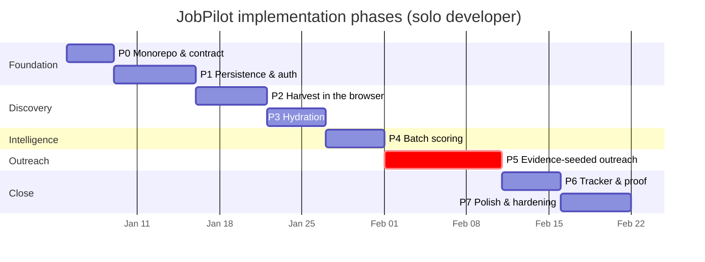
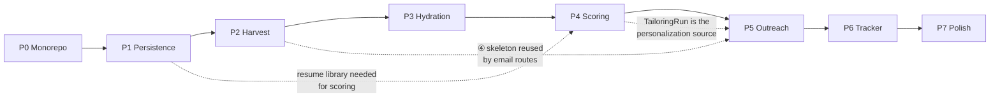

# JobPilot — Phase-Wise Implementation Plan

**References:** [`problemStatement.md`](./problemStatement.md) (what and why) · [`architecture.md`](./architecture.md) (how)
**Status:** Phases 0 and 1 complete. Phase 2 (harvest in the browser) is next.
**Assumed team:** one developer. Estimates are focused working days, not calendar days.

---

## How to Read This Plan

### Task IDs

`P{phase}.{group}.{n}` — e.g. `P5.3.2` is Phase 5, group 3, task 2. Referenced from commits and PRs.

### Provenance markers

Carried from [`architecture.md`](./architecture.md) §1. Every task is one of:

| Marker | Meaning | What it implies for effort |
|--------|---------|---------------------------|
| 🟢 **EXISTING** | Move the file, call it unchanged | Hours, not days. If it takes longer, you are rewriting — stop |
| 🟡 **ADAPTED** | Change the I/O boundary, keep the logic | The bulk of the real work |
| 🔴 **NEW** | Written for the platform | Must justify why no existing code fits |
| ⚫ **RETIRED** | Deleted; its responsibility moved | Verify nothing still imports it |

### Container ownership

| Symbol | Container |
|--------|-----------|
| ① | Next.js WEB |
| ② | Redis / BullMQ |
| ③ | Node orchestrator (the single writer) |
| ④ | FastAPI Python service (stateless) |

### Guiding principles for this plan

1. **Ship vertically.** Every phase ends in something you can show a person. No phase delivers "the database layer."
2. **Reuse over rewrite.** If a phase's task list is mostly 🔴, the design drifted — go back to [`architecture.md`](./architecture.md) §21.
3. **The gate before the door.** In any phase that touches sending, safety code lands before the code it guards. See P5's ordering rule.
4. **Non-goals are firm.** [`problemStatement.md`](./problemStatement.md) §7 is the scope contract. Each phase below also lists what is explicitly *not* in it.

---

## Overview



| Phase | Name | Closes | Days | Demo |
|-------|------|--------|------|------|
| **0** | Monorepo and contract | — | 4 | All three projects run from one tree |
| **1** | Persistence and auth | Breakage 3 (part) | 7 | Tailor, close browser, reopen — run is still there |
| **2** | Harvest in the browser | — | 6 | Search in a browser, results stream in per board |
| **3** | Hydration | **Breakage 1** | 5 | Click a scraped job → full parsed requirements, zero paste |
| **4** | Batch scoring | **Breakage 4** | 5 | 20 jobs ranked by real fit; tailor the top one in two clicks |
| **5** | Evidence-seeded outreach | **Breakage 2** | 10 | Tailoring evidence → personalized email → Gmail draft → audit row |
| **6** | Tracker and proof | **Breakage 3** | 5 | The full funnel for 5 real jobs on one screen |
| **7** | Polish and hardening | — | 6 | Portfolio-quality end-to-end demo |

**Total: ~48 focused days (≈10 weeks solo).**

**Minimum shippable product is Phase 5.** Phases 6–7 are the difference between "works" and "shippable." If time runs out, cut into Phase 7 first, then Phase 6 — never into Phase 5's safety tasks.

---

## Phase 0 — Monorepo and Contract

**Objective:** one tree, three projects still working, one schema contract, one database.
**Duration:** 4 days.
**Prerequisites:** none.

### P0.1 — Repository structure

| # | Task | Marker | Where |
|---|------|--------|-------|
| P0.1.1 | Init monorepo (pnpm workspaces + Turborepo) per [`architecture.md`](./architecture.md) §5 layout | 🔴 | root |
| P0.1.2 | Import `Resume-Builder` → `apps/web/`, verify `npm run dev` still works untouched | 🟢 | ① |
| P0.1.3 | Import `job-harvester` → `services/python/harvester/`, verify CLI still runs | 🟢 | ④ |
| P0.1.4 | Import `cold-email-sender` → `services/python/outreach/`, verify CLI still runs in dry-run | 🟢 | ④ |
| P0.1.5 | Preserve git history of all three via `git subtree add` (not copy-paste) | 🔴 | root |
| P0.1.6 | Root `README.md` explaining the merge and pointing at all three docs | 🔴 | docs |

> **P0.1.5 matters more than it looks.** Losing three repos' history to a copy-paste import makes every future "why is this line here?" unanswerable. Subtree keeps blame intact.

### P0.2 — Shared schema contract

| # | Task | Marker | Where |
|---|------|--------|-------|
| P0.2.1 | Create `packages/shared-schemas/`; move existing Zod domain types in | 🟡 | shared |
| P0.2.2 | Add platform entities to Zod: `Job`, `JobDescription`, `Application`, `Contact`, `OutreachAttempt`, `HarvestRun` | 🔴 | shared |
| P0.2.3 | Define the five wire types ([`architecture.md`](./architecture.md) §8) in `wire.ts` | 🔴 | shared |
| P0.2.4 | Build the Zod → JSON Schema → Pydantic codegen script | 🔴 | shared |
| P0.2.5 | Commit `generated/models.py`; add `.gitattributes` marking it generated | 🔴 | shared |
| P0.2.6 | CI job: regenerate + `git diff --exit-code` (fails the build on drift) | 🔴 | CI |

### P0.3 — Data layer

| # | Task | Marker | Where |
|---|------|--------|-------|
| P0.3.1 | Decide Prisma vs Drizzle (open question §22.2) and record the decision in `architecture.md` | 🔴 | ① |
| P0.3.2 | Write the initial migration from [`architecture.md`](./architecture.md) §7.2 DDL | 🔴 | ① |
| P0.3.3 | `lib/db/repository.ts` — tenant-scoped accessors only | 🔴 | ① |
| P0.3.4 | ESLint rule banning raw `prisma.*` / `db.*` outside `lib/db/` | 🔴 | ① |
| P0.3.5 | Seed script: one user, one sample resume, five sample jobs | 🔴 | ① |

### P0.4 — Local environment

| # | Task | Marker | Where |
|---|------|--------|-------|
| P0.4.1 | `docker-compose.yml`: Postgres, Redis, MinIO, ④ | 🔴 | root |
| P0.4.2 | ④ Dockerfile with Playwright + Chromium base image | 🔴 | ④ |
| P0.4.3 | Consolidated `.env.example` from [`problemStatement.md`](./problemStatement.md) §14 | 🔴 | root |
| P0.4.4 | **Force `DRY_RUN=true` in local + CI at the config layer**, ignoring any override | 🔴 | ①④ |
| P0.4.5 | Root scripts: `dev`, `test`, `lint`, `typecheck`, `db:migrate`, `schemas:gen` | 🔴 | root |

### Out of scope for Phase 0

No auth. No new UI. No wiring between containers. Three projects that happen to share a tree is the entire deliverable.

### Deliverables

- Monorepo with git history intact for all three projects.
- `packages/shared-schemas` with working two-way codegen and CI enforcement.
- Postgres schema migrated; seed data loads.
- `docker compose up` gives a complete local stack.

### Acceptance criteria

- [ ] `pnpm dev` starts ① against local Postgres
- [ ] `python -m harvester --role "AI Engineer" --limit 5` still produces a CSV, unmodified
- [ ] `python -m outreach.main` still previews emails in dry-run, unmodified
- [ ] `pnpm schemas:gen` produces zero diff on a clean tree
- [ ] Deliberately editing a Zod type fails CI
- [ ] `pnpm db:migrate && pnpm db:seed` succeeds from empty

### Exit gate → Phase 1

- [ ] ORM decision recorded with rationale
- [ ] Every table in §7.2 exists with its CHECK constraints and unique indexes
- [ ] Codegen round-trips `EmailDraft` and `Contact` correctly

---

## Phase 1 — Persistence and Auth

**Objective:** Resume Shapeshifter stops forgetting. Tailoring runs survive the browser.
**Duration:** 7 days.
**Closes:** half of Breakage 3.

### P1.1 — Authentication

| # | Task | Marker | Where |
|---|------|--------|-------|
| P1.1.1 | Decide auth provider (open question §22.1) | 🔴 | ① |
| P1.1.2 | Wire sign-in/sign-up/sign-out; sessions on `users.id` | 🔴 | ① |
| P1.1.3 | Route middleware protecting `/(dashboard)/*` and `/api/*` | 🔴 | ① |
| P1.1.4 | Profile page: `candidate_name`, `candidate_background`, `portfolio_url`, `linkedin_url` | 🔴 | ① |
| P1.1.5 | Settings page: `dry_run`, `send_mode`, `max_outreach_per_day` — **read-only display in P1**, editable in P5 | 🔴 | ① |

> P1.1.4 is where The Closer's per-contact sender fields get hoisted to the user ([`architecture.md`](./architecture.md) §7.2). Doing it now means P5 never has to think about it.

### P1.2 — Resume library (FR3)

| # | Task | Marker | Where |
|---|------|--------|-------|
| P1.2.1 | `POST /api/resumes` — upload → `document-extract.ts` → parse prompt → persist | 🟡 | ① |
| P1.2.2 | Object-storage adapter (S3/MinIO) with opaque keys | 🔴 | ① |
| P1.2.3 | Store `raw_text` alongside `profile` — never discard the original | 🔴 | ① |
| P1.2.4 | Version list UI; set-default action; `one_default_resume_per_user` index enforced | 🔴 | ① |
| P1.2.5 | Enforce `MAX_UPLOAD_MB` + content-type sniffing pre-parse | 🟡 | ① |

### P1.3 — Rewire tailoring onto the database

| # | Task | Marker | Where |
|---|------|--------|-------|
| P1.3.1 | Reimplement `run-client-store.ts`'s interface over `lib/db/` (anti-corruption layer) | 🟡 | ① |
| P1.3.2 | Point `hooks/useTailoringRun.ts` at the new store — **interface unchanged** | 🟡 | ① |
| P1.3.3 | Persist `TailoringRun` incl. `guardrail_report`, `model`, `prompt_version`, `token_usage` | 🟡 | ① |
| P1.3.4 | Create `prompts/versions.ts`; stamp `prompt_version` on every run | 🔴 | ① |
| P1.3.5 | `GET /api/runs/[id]` reads from DB, tenant-scoped | 🟡 | ① |
| P1.3.6 | Persist exported PDFs to object storage → `exported_documents` | 🟡 | ① |
| P1.3.7 | Auth + tenant scoping on `/api/analyze`, `/api/tailor`, `/api/export/pdf` | 🟡 | ① |
| P1.3.8 | Delete `lib/run-client-store.ts` | ⚫ | ① |

### P1.4 — Guardrails move server-side

| # | Task | Marker | Where |
|---|------|--------|-------|
| P1.4.1 | Confirm `guardrails.ts` runs **before persistence**, never after | 🟢 | ① |
| P1.4.2 | Persist blocked changes as rejected-with-reason in `guardrail_report` | 🔴 | ① |
| P1.4.3 | Surface the guardrail report in the review UI | 🟡 | ① |

### P1.5 — Safety tests (first tranche)

| # | Task | From [`architecture.md`](./architecture.md) §19 |
|---|------|--------------------------|
| P1.5.1 | Fabricated employer in an LLM response → blocked before persistence | safety test 8 |
| P1.5.2 | Cross-tenant read of another user's run → 404 | safety test 10 |

### Out of scope for Phase 1

No harvesting. No queue. No ④ integration. JD still arrives by paste — that is Phase 3's job.

### Deliverables

- Multi-user app with persistent, resumable tailoring runs.
- Resume library with versions and a default.
- Guardrails enforced server-side, results audited.

### Acceptance criteria

- [ ] Sign in, upload a resume, sign out, sign back in — resume is still there
- [ ] Tailor a JD, close the browser, reopen the run URL — full run renders
- [ ] Two accounts cannot see each other's resumes, runs, or PDFs
- [ ] A tailoring run records `model` and `prompt_version`
- [ ] A blocked rewrite appears in the UI as rejected with a reason, not silently dropped
- [ ] `useTailoringRun.ts` diff touches only the store import

### Exit gate → Phase 2

- [ ] Zero `sessionStorage` references remain in the tailoring path
- [ ] Safety tests 8 and 10 pass in CI
- [ ] A run created before a prompt edit still renders correctly afterward

---

## Phase 2 — Harvest in the Browser

**Objective:** the harvester runs from a web form, with per-board progress and isolation.
**Duration:** 6 days.

### P2.1 — Python service skeleton (④)

| # | Task | Marker | Where |
|---|------|--------|-------|
| P2.1.1 | FastAPI app: service-token middleware, error mapping, health check | 🔴 | ④ |
| P2.1.2 | `POST /boards/{board}/search` → adapter → wire response | 🔴 | ④ |
| P2.1.3 | Split `harvester.py`: argparse discarded, orchestration extracted | 🟡 | ④ |
| P2.1.4 | Verify `boards/*.py` are called **unchanged** | 🟢 | ④ |
| P2.1.5 | Per-board request logging with duration + outcome, no PII | 🔴 | ④ |
| P2.1.6 | pytest against recorded cassettes — **no live sites in CI** | 🔴 | ④ |

### P2.2 — Queue and orchestrator (②③)

| # | Task | Marker | Where |
|---|------|--------|-------|
| P2.2.1 | BullMQ setup; typed job payloads in `lib/queue/` | 🔴 | ①③ |
| P2.2.2 | Orchestrator bootstrap as a separate entrypoint on the shared codebase | 🔴 | ③ |
| P2.2.3 | `harvest:run` handler — fans out to `harvest:board` children | 🔴 | ③ |
| P2.2.4 | `harvest:board` handler — call ④, persist Jobs, update `board_results` | 🔴 | ③ |
| P2.2.5 | Deterministic job IDs (`harvest:{runId}:{board}`) for idempotency | 🔴 | ③ |
| P2.2.6 | Port dedupe logic → stable `dedupe_key`; upsert on `(user_id, dedupe_key)` | 🟡 | ③ |
| P2.2.7 | Per-board global concurrency caps ([`architecture.md`](./architecture.md) §10.1) | 🔴 | ③ |
| P2.2.8 | Redis token-bucket rate limiter, `SCRAPE_RATE_LIMIT_PER_MIN` per board | 🔴 | ③ |
| P2.2.9 | Typed `worker-client.ts` with timeout + retry + backoff | 🔴 | ①③ |
| P2.2.10 | **Board failure is data, not an exception** — record and continue | 🔴 | ③ |

### P2.3 — Search UI (①)

| # | Task | Marker | Where |
|---|------|--------|-------|
| P2.3.1 | `POST /api/harvest` → 202 + `runId` | 🔴 | ① |
| P2.3.2 | `GET /api/harvest/:id` — durable status + per-board results | 🔴 | ① |
| P2.3.3 | `GET /api/harvest/:id/events` — SSE over Redis pub/sub | 🔴 | ① |
| P2.3.4 | `/search` page: role, location, boards, limit | 🔴 | ① |
| P2.3.5 | Live per-board progress; partial results as they land | 🔴 | ① |
| P2.3.6 | `/jobs` table: title, company, location, source, posted, link | 🔴 | ① |
| P2.3.7 | **Polling fallback when SSE drops** — durable record is the source of truth | 🔴 | ① |
| P2.3.8 | `POST /api/jobs/manual` — add a job by URL (the always-open path) | 🔴 | ① |

### P2.4 — Scraping conduct

| # | Task | Marker | Where |
|---|------|--------|-------|
| P2.4.1 | Honest static User-Agent with a contact URL. No rotation, ever | 🔴 | ④ |
| P2.4.2 | `robots.txt` fetch + cache per host, checked before any request | 🔴 | ④ |
| P2.4.3 | Per-board circuit breaker in Redis ([`architecture.md`](./architecture.md) §11.3) | 🔴 | ③ |
| P2.4.4 | `posted_at_parsed` best-effort normalization per board | 🔴 | ③ |

### Out of scope for Phase 2

No JD text. No scoring. The job table shows what `jobs.csv` always showed — just in a browser, deduplicated across runs.

### Deliverables

- Web-triggered harvest with live per-board progress.
- Board failures isolated and reported with reasons.
- Cross-run deduplication.

### Acceptance criteria

- [ ] Search "AI Engineer" / "Bengaluru" → results from ≥2 boards inside 90s
- [ ] Killing one board (bad key, forced error) still yields a `partial` run with the others' results
- [ ] Re-running the same search creates no duplicate `jobs` rows
- [ ] Refreshing mid-harvest restores progress from the durable record
- [ ] Circuit breaker opens after forced repeated failures and the run still completes
- [ ] Rate limiter holds under two concurrent users searching the same board

### Exit gate → Phase 3

- [ ] `boards/*.py` diff versus the original repo is empty
- [ ] Orchestrator survives a Redis restart mid-run without duplicating jobs
- [ ] Every board has a cassette test

---

## Phase 3 — Hydration

**Objective:** close Breakage 1. The JD arrives without a human copying it.
**Duration:** 5 days.

### P3.1 — Fetcher (④)

| # | Task | Marker | Where |
|---|------|--------|-------|
| P3.1.1 | `fetcher.py`: single URL → Firecrawl, fallback Playwright | 🔴 | ④ |
| P3.1.2 | `POST /hydrate` → `{raw_text, method, blocked, reason}` | 🔴 | ④ |
| P3.1.3 | Optional `HydratingAdapter` mixin; per-board extractors where DOM is known | 🔴 | ④ |
| P3.1.4 | **SSRF guard** ([`architecture.md`](./architecture.md) §11.5): https-only, host allowlist, public-IP check, ≤3 redirects each re-validated, 5 MB cap | 🔴 | ④ |
| P3.1.5 | Blocked/bot-walled → return `blocked:true`, never escalate or evade | 🔴 | ④ |

> **P3.1.4 is not optional and not a Phase 7 hardening item.** `POST /api/jobs/manual` (P2.3.8) already accepts user-supplied URLs, so the SSRF surface exists the moment the fetcher does. DNS must be re-resolved on every redirect hop — an allowlisted host can 302 to a link-local address.

### P3.2 — Hydration pipeline (③)

| # | Task | Marker | Where |
|---|------|--------|-------|
| P3.2.1 | `hydrate:job` handler; deterministic ID `hydrate:{jobId}` | 🔴 | ③ |
| P3.2.2 | `jd_cache` lookup on `sha256(normalized_url)` before any network call | 🔴 | ③ |
| P3.2.3 | Run the existing JD extraction prompt on `raw_text` | 🟢 | ③ |
| P3.2.4 | Persist `job_descriptions`; set `hydration_status` | 🔴 | ③ |
| P3.2.5 | Populate `jd_cache` on every successful fetch | 🔴 | ③ |
| P3.2.6 | Code comment at the cache write: **JD text is public; contacts are never cached** | 🔴 | ③ |

### P3.3 — Hydration UI (①)

| # | Task | Marker | Where |
|---|------|--------|-------|
| P3.3.1 | `POST /api/jobs/hydrate` — selected job IDs → 202 | 🔴 | ① |
| P3.3.2 | Job table: multi-select + "Hydrate selected" (**never auto-hydrate a whole run**) | 🔴 | ① |
| P3.3.3 | `/jobs/[id]` detail: raw JD, extracted requirements, method badge | 🔴 | ① |
| P3.3.4 | `POST /api/jobs/:id/jd` — manual paste box for `blocked`/`failed` | 🔴 | ① |
| P3.3.5 | Per-job hydration status indicators | 🔴 | ① |

### Out of scope for Phase 3

No scoring against the resume. The JD is parsed and displayed; nothing compares it to anything yet.

### Deliverables

- One-click hydration of selected jobs, cached permanently.
- Manual paste fallback wherever automation fails.
- SSRF-safe fetcher.

### Acceptance criteria

- [ ] Select 3 jobs → hydrate → structured requirements render with zero copy-paste
- [ ] Re-hydrating the same URL makes no second network call (cache hit visible in logs)
- [ ] A `robots.txt`-disallowed URL is refused and routed to manual paste
- [ ] A blocked job's paste box produces an identical downstream `JobDescription` (`method='manual_paste'`)
- [ ] SSRF suite: `localhost`, `169.254.169.254`, `file://`, and an allowlisted-host→link-local redirect all rejected
- [ ] Firecrawl key removed → Playwright fallback still hydrates

### Exit gate → Phase 4

- [ ] `jd_cache` hit ratio > 0 on a repeat run
- [ ] Every hydration failure mode lands the user at a paste box, never an error page

---

## Phase 4 — Batch Scoring

**Objective:** close Breakage 4. Twenty jobs, ranked by real fit, affordably.
**Duration:** 5 days.

### P4.1 — Tier 0: heuristic (③)

| # | Task | Marker | Where |
|---|------|--------|-------|
| P4.1.1 | Promote `heuristic-resume.ts` to a scorer: keyword overlap, title similarity, seniority | 🟡 | ③ |
| P4.1.2 | Unit tests with fixture resume × 20 fixture JDs | 🔴 | ③ |
| P4.1.3 | Configurable floor (default 20); **advisory only, never hides a job** | 🔴 | ③ |

### P4.2 — Tier 1: cheap LLM (③)

| # | Task | Marker | Where |
|---|------|--------|-------|
| P4.2.1 | Trimmed scoring prompt targeting `SCORING_MODEL` | 🟡 | ③ |
| P4.2.2 | Batch N jobs per request (start at 5, measure — open question §22.2 Q4) | 🔴 | ③ |
| P4.2.3 | `score:batch` handler; upsert `applications` with `original_score` | 🔴 | ③ |
| P4.2.4 | Persist a `tailoring_runs` row with `tier='cheap'`, no `tailored_resume` | 🔴 | ③ |
| P4.2.5 | Reuse existing Zod validation + single structured retry | 🟢 | ③ |
| P4.2.6 | Emit `llm_tokens_total{tier,model}` | 🔴 | ③ |

### P4.3 — Ranked board (①)

| # | Task | Marker | Where |
|---|------|--------|-------|
| P4.3.1 | `POST /api/jobs/score-batch` → 202 | 🔴 | ① |
| P4.3.2 | Job table sorted by score; sub-scores + one-line explanation per row | 🔴 | ① |
| P4.3.3 | Filters: score band, board, location, recency, hydration status | 🔴 | ① |
| P4.3.4 | Tier badge on every score (`heuristic` / `cheap` / `full`) | 🔴 | ① |
| P4.3.5 | "Tailor this one" → `/tailor/[jobId]` | 🔴 | ① |
| P4.3.6 | Low-fit filter view — Tier-0-filtered jobs remain reachable and tailorable | 🔴 | ① |

### P4.4 — Tier 2 wiring (①)

| # | Task | Marker | Where |
|---|------|--------|-------|
| P4.4.1 | `/tailor/[jobId]` loads resume + JD from DB instead of paste boxes | 🟡 | ① |
| P4.4.2 | Mount the existing `TailorFlow` at the new route | 🟢 | ① |
| P4.4.3 | On completion: write `tailored_score`, set `applications.status='tailored'` | 🔴 | ① |
| P4.4.4 | Remove the JD paste box from the tailor flow (keep it on `/jobs/[id]`) | 🟡 | ① |

### Out of scope for Phase 4

No contacts, no email. The pipeline ends at a proof PDF — exactly where Resume Shapeshifter ended, but now fed automatically.

### Deliverables

- Three-tier scoring with ~40× cost reduction versus full-chain-across-the-board.
- Ranked, filterable job board.
- Two-click path from search result to tailoring.

### Acceptance criteria

- [ ] 20 hydrated jobs scored end-to-end in under 60s
- [ ] Every score shows sub-scores, an explanation, and its tier
- [ ] A Tier-0-filtered job is still reachable and tailorable from the low-fit view
- [ ] "Tailor this one" produces a run identical in shape to a Phase 1 run
- [ ] Token metrics show Tier-1 cost per harvest is a small fraction of one Tier-2 run
- [ ] Guardrails still fire on Tier-2 output (safety test 8 unchanged)

### Exit gate → Phase 5

- [ ] Tier-1 batch size chosen from measurement, and the number recorded in `architecture.md` §22.2 Q4
- [ ] `orchestrator.ts`'s single-job path is byte-identical in behavior to Phase 1

---

## Phase 5 — Evidence-Seeded Outreach

**Objective:** close Breakage 2 and deliver the feature that only exists because the projects merged.
**Duration:** 10 days. **This is the critical phase.**

### ⚠ Ordering rule: the gate before the door

Build in strict group order. Delivery code (P5.5) must be **physically impossible to reach** until the interlock chain (P5.4) exists and its tests pass. Do not reorder for convenience — a half-built gate is worse than no gate, because it looks like one.

```text
P5.1 contacts  →  P5.2 generation  →  P5.3 review UI
                                            ↓
                                   P5.4 INTERLOCKS  ←── tests pass here
                                            ↓
                                   P5.5 delivery
```

### P5.1 — Contacts (FR6)

| # | Task | Marker | Where |
|---|------|--------|-------|
| P5.1.1 | `POST /api/contacts` — `source` **required**, no default | 🔴 | ① |
| P5.1.2 | Contact form: company/role/job URL auto-filled from the `Job` | 🔴 | ① |
| P5.1.3 | `POST /api/contacts/import` — CSV, reusing the existing column mapping | 🟡 | ① |
| P5.1.4 | `POST /api/optout` + opt-out list management UI | 🔴 | ① |
| P5.1.5 | Display `source` provenance wherever a contact is shown | 🔴 | ① |
| P5.1.6 | Set `applications.status='contact_added'` | 🔴 | ① |

> **Do not add a "find contact" button, an enrichment API, or a pattern guesser.** ADR-008. If this feels like a missing feature during implementation, that is the design working as intended.

### P5.2 — Generation (FR7)

| # | Task | Marker | Where |
|---|------|--------|-------|
| P5.2.1 | `personalization.ts` — pure `TailoringRun → PersonalizationPayload` | 🔴 | ① |
| P5.2.2 | Unit-test the builder with fixture runs, no LLM in the loop | 🔴 | ① |
| P5.2.3 | `POST /email/generate` in ④ wrapping `email_generator.py` | 🟡 | ④ |
| P5.2.4 | `llm_generator.py` accepts the payload; **validator unchanged** | 🟡 | ④ |
| P5.2.5 | Prompt instruction: `honestGaps` is what *not* to claim competence in | 🔴 | ④ |
| P5.2.6 | Null payload → plain six-part template + generic-hook warning | 🟢 | ④ |
| P5.2.7 | `POST /api/outreach/generate`; write `OutreachAttempt` as `generated` | 🔴 | ① |
| P5.2.8 | Missing `GROQ_API_KEY` → template fallback, never an error | 🟢 | ④ |

### P5.3 — Outreach guardrails + review UI

| # | Task | Marker | Where |
|---|------|--------|-------|
| P5.3.1 | Grounding checks ([`architecture.md`](./architecture.md) §13.3): unlisted skill → FLAG; named person/referral → BLOCK; unsupported credential → BLOCK | 🔴 | ① |
| P5.3.2 | Word-limit + generic-hook warnings surfaced | 🟢 | ① |
| P5.3.3 | BLOCK → fall back to the deterministic template | 🔴 | ① |
| P5.3.4 | `/outreach/[appId]` review screen: draft, subject options, warnings | 🔴 | ① |
| P5.3.5 | **Evidence panel** — show which tailoring output produced each hook | 🔴 | ① |
| P5.3.6 | Editable body; edits recompute the hash | 🔴 | ① |
| P5.3.7 | Skip action → `OutreachAttempt` status `skipped` (skips are logged too) | 🔴 | ① |

### P5.4 — Interlocks (the safety core)

| # | Task | Marker | Where |
|---|------|--------|-------|
| P5.4.1 | `POST /api/outreach/:id/approve` — write `ReviewEvent`, mint single-use token (10 min TTL) | 🔴 | ① |
| P5.4.2 | Store `body_hash` of exactly what was approved | 🔴 | ① |
| P5.4.3 | `lib/interlocks.ts` — all 12 checks in order ([`architecture.md`](./architecture.md) §14.3) | 🔴 | ① |
| P5.4.4 | Opt-out suppression (port of `recipient_filter.py`; its tests port directly) | 🔴 | ① |
| P5.4.5 | Dedup against prior `sent`/`drafted` for the same contact | 🔴 | ① |
| P5.4.6 | Rolling 24h volume cap — a query, not a counter | 🔴 | ① |
| P5.4.7 | Atomic token burn: `UPDATE … WHERE token_used_at IS NULL RETURNING` | 🔴 | ① |
| P5.4.8 | Every block writes `status='failed'` with the specific check that failed | 🔴 | ① |
| P5.4.9 | Emit `interlock_block_total{check}` | 🔴 | ① |

### P5.5 — Delivery

| # | Task | Marker | Where |
|---|------|--------|-------|
| P5.5.1 | `sender_credentials` table + AES-256-GCM envelope encryption, versioned key | 🔴 | ① |
| P5.5.2 | `POST /email/preflight` wrapping `smtp_check.py` | 🟢 | ④ |
| P5.5.3 | Gmail OAuth consent flow; encrypted refresh token (**never migrate `token.json`**) | 🟡 | ① |
| P5.5.4 | `POST /email/deliver` — per-request credentials, used and discarded | 🟡 | ④ |
| P5.5.5 | Redact request bodies in ④'s exception handler and logs | 🔴 | ④ |
| P5.5.6 | `POST /api/outreach/:id/deliver` — interlocks → burn token → call ④ | 🔴 | ① |
| P5.5.7 | Dry-run path runs checks 1–9 and logs, with **zero** network calls | 🔴 | ① |
| P5.5.8 | Persist `body_snapshot`, `provider_message_id`, terminal status | 🔴 | ① |
| P5.5.9 | `applications.status='emailed'` on success | 🔴 | ① |
| P5.5.10 | Make settings from P1.1.5 editable; `dry_run` off requires a successful preflight | 🔴 | ① |

### P5.6 — Safety suite (remaining tranche)

| # | Test | From §19 |
|---|------|----------|
| P5.6.1 | Delivery without a token → blocked | 1 |
| P5.6.2 | Token minted for different body content → blocked | 2 |
| P5.6.3 | Token replay → second attempt blocked | 3 |
| P5.6.4 | Suppressed recipient → blocked and logged | 4 |
| P5.6.5 | Cap exceeded → blocked at N+1 | 5 |
| P5.6.6 | `DRY_RUN=true` → **zero socket activity**, asserted at the socket layer | 6 |
| P5.6.7 | Missing config → defaults to dry-run + draft | 7 |
| P5.6.8 | Email claiming an unsupported credential → blocked, template used | 9 |

### Out of scope for Phase 5

No tracker board. No follow-ups. No bulk anything — and there is no `send-all` endpoint to build, by design.

### Deliverables

- Contacts with mandatory provenance, opt-out, and dedup.
- Evidence-seeded generation traceable to persisted tailoring output.
- A 12-check interlock chain that a `curl` user cannot bypass.
- Real Gmail drafts, fully audited.

### Acceptance criteria

A box is ticked only where an automated test proves it. "Built but unverified"
is left unticked on purpose — the whole point of this list is that it cannot be
satisfied by reading the code.

- [x] Generated email's hook cites a skill present in `topMatchedSkills` — verifiable against the DB row
- [ ] Evidence panel shows the tailoring artifact behind each hook
- [x] A hand-crafted `curl` to `/deliver` without a token is rejected
- [x] Approving, then editing the body, then delivering → rejected on hash mismatch
- [x] Opt-out recipient → blocked, `failed` row with reason `opt_out`
- [x] Second email to the same contact → blocked by dedup
- [x] With `DRY_RUN=true`, a full send attempt opens no sockets and still logs
- [x] With `DRY_RUN=false` + valid OAuth → real Gmail draft appears, `provider_message_id` stored
- [x] Removing `GROQ_API_KEY` → template path, everything still works
- [x] All eight P5.6 tests green

**Where the ticks come from.**

- `tests/safety/outreach-interlocks.test.ts` (27) — the chain REFUSES: token,
  hash, opt-out, dedup, cap and mode, at the interlock layer, which is the
  enforcement point. Includes two concurrency cases written with real
  `Promise.all`, since both are invisible when tested sequentially.
- `tests/safety/outreach-audit-trail.test.ts` (10) — the refusal is RECORDED.
  A separate claim and a separate failure mode: `runInterlocks` can return a
  perfect block while the route forgets the row, and every test in the file
  above would still pass. These drive the real handler, so they also pin the
  order interlocks → burn → provider.
- `services/python/tests/test_delivery_safety.py` (10) — dry run at the socket
  layer, credential redaction, and the template fallback.

**The live draft, verified end to end (2026-08-14).** Against real Google OAuth,
a real encryption key, and `DRY_RUN=false`:

```
status             : drafted
provider           : gmail_api
providerMessageId  : r-4695525824728658568
providerAttemptedAt: 2026-08-14T00:48:17.638Z
errorMessage       : (none)
application        : AI Engineer -> emailed
tokens             : 5 minted, exactly 1 burned
```

Four earlier attempts were refused by the chain and are worth recording,
because they are the interlocks working rather than anecdotes: three at check 8
(262 words against the 150 limit, caused by a résumé summary pasted into the
profile background field, which the template interpolates into one sentence)
and one at check 12 (`send_mode='send'` against a `gmail.compose` grant —
EC-P5-65 catching the mismatch before contacting Google). Every one wrote a
`failed` row naming its check, left `provider_attempted_at` null, and left its
approval token unburned.

**The LLM path, verified (2026-08-14).** Every email before this came back as
`source: "template"` — and the cause was not generation at all. ④ had no
`GROQ_API_KEY`, because `npm run py:worker` launches uvicorn directly and
main.py never loaded a `.env`, so `use_llm` resolved to False on every request.
Template fallback on a missing key is correct, deliberate behaviour (EC-P5-28)
reported honestly in `source`, which is exactly why it went unnoticed: the
system told the truth every time while never once doing the thing P5.2 exists
to do. A silent, correct degradation is harder to see than a failure.

With ④ given its configuration, generation against the real payload from this
account's tailoring run:

```
source      llm
word_count  89
payload     topMatchedSkills = ["Python", "PostgreSQL", "retrieval pipelines"]
body        cites Python, PostgreSQL, and the 40k-queries retrieval bullet
honestGaps  ["Kubernetes"] passed in — and absent from the body entirely
```

That last line is EC-P5-24 demonstrated on live output rather than in a
fixture: gaps enter the prompt as a suppression list and stay out of the email.

**What the one remaining box still needs:**

| Box | Blocked on |
|-----|-----------|
| Evidence panel | A full tailoring run now backs it, so it renders a real payload rather than the EC-P5-40 empty state. Wants one deliberate look in a browser — the only criterion here that cannot be settled from the database. |

### Exit gate → Phase 6

- [x] Every §19 safety test passes
- [x] Grep confirms no bulk-send code path exists anywhere
- [x] A self-addressed live draft was created and verified in Gmail
- [x] Credentials appear in no log line, no trace, no error body

The last credential item was checked the way EC-P5-61 asks: a 422 was forced out
of ④ and the full response **and** captured log output were grepped for the
password. FastAPI's default handler echoes the offending value in `input`, which
on `/email/deliver` is an app password — so this passes only because both ④ and
① redact, and it would regress the moment either side stopped.

**The exit gate is closed.** All four items pass, including the one that proves
the phase delivers mail rather than merely refusing to.

Two acceptance criteria remain open, both about the QUALITY of a generated
email rather than the safety of delivering it, and neither blocks Phase 6.

---

## Phase 6 — Tracker and Proof

**Objective:** close Breakage 3 completely. The system of record becomes visible.
**Duration:** 5 days.

### P6.1 — Application tracker (FR9)

| # | Task | Marker | Where |
|---|------|--------|-------|
| P6.1.1 | `GET /api/applications` — job, scores, resume version, contact, last outreach | 🔴 | ① |
| P6.1.2 | `/tracker` board or table grouped by status | 🔴 | ① |
| P6.1.3 | Automatic transitions: scored → tailored → contact_added → emailed | 🔴 | ① |
| P6.1.4 | Manual override for `replied`, `interviewing`, `rejected`, `closed` | 🔴 | ① |
| P6.1.5 | Per-application timeline: every outreach attempt including skips and failures | 🔴 | ① |
| P6.1.6 | Notes field | 🔴 | ① |

### P6.2 — Follow-ups (FR10)

| # | Task | Marker | Where |
|---|------|--------|-------|
| P6.2.1 | `followup:sweep` cron handler: `emailed` + no reply after N days | 🔴 | ③ |
| P6.2.2 | Call `followup_generator.py` with the parent's `body_snapshot` | 🟡 | ④ |
| P6.2.3 | Create attempts as `generated` with `parent_id` — **never delivered by the sweep** | 🔴 | ③ |
| P6.2.4 | Follow-up review queue routing through the identical interlock chain | 🔴 | ① |
| P6.2.5 | Decide and configure N (open question §22.6) | 🔴 | ① |

> P6.2.3 is the phase's one genuinely dangerous task. A sweep that could send is an automated cold-email engine — precisely what §12.3 forbids. The sweep generates; the human still approves each one.

### P6.3 — Proof export (FR11)

| # | Task | Marker | Where |
|---|------|--------|-------|
| P6.3.1 | `GET /api/export/bundle` — zip of side-by-side PDFs + outreach log + summary | 🔴 | ① |
| P6.3.2 | Pipeline summary: jobs harvested, hydrated, scored, tailored, contacted | 🔴 | ① |
| P6.3.3 | Outreach log CSV export matching the original `outreach_log.csv` columns | 🔴 | ① |
| P6.3.4 | Truthfulness disclaimer in the bundle README | 🔴 | ① |

### P6.4 — Legacy import

| # | Task | Marker | Where |
|---|------|--------|-------|
| P6.4.1 | Import `jobs.csv` → `jobs` under a synthetic harvest run | 🔴 | ① |
| P6.4.2 | Import `outreach_log.csv` → `outreach_attempts`, flagged `legacy_import` | 🔴 | ① |
| P6.4.3 | Import `do_not_contact.csv` → `opt_out_entries` | 🔴 | ① |

### Deliverables

- Full-funnel tracker with automatic and manual status transitions.
- Follow-up generation that cannot self-send.
- Portfolio-ready evidence bundle.

### Acceptance criteria

A box is ticked only where an automated test or live data proves it.

- [ ] Five real jobs visible on one screen with scores, resume versions, and outreach history
- [x] Statuses advance automatically as the pipeline runs
- [ ] A follow-up appears in the review queue and requires the same approval to send
- [ ] The bundle opens and contains PDFs, log, and summary
- [x] Legacy CSVs import without duplicating existing rows

**Where the ticks come from.** `tests/tracker/status-machine.test.ts` (12) and
`tests/tracker/followup-rules.test.ts` (14) cover the transition rules and the
sweep's selection; `tests/export/bundle.test.ts` (9) covers the artifact;
`tests/safety/followup-cannot-send.test.ts` (6) covers EC-P6-13 and is
mutation-verified. Automatic advancement is also demonstrated on live data —
this account's application moved `contact_added → emailed` on delivery.

**What the three open boxes still need:**

| Box | Blocked on |
|-----|-----------|
| Five jobs on one screen | Volume, not capability. The tracker renders one real application today with its score, resume version and seven attempts; the criterion asks for five, which needs a live harvest and scoring run. |
| Follow-up in the review queue | Nothing is eligible yet, correctly. The sweep keys off `outreach_attempts.status='sent'` (EC-P6-11) and this account's only delivery is a Gmail **draft** — following up on an unsent email is the failure that rule exists to prevent. Needs a real send, then seven days. |
| Bundle contains PDFs | **Genuinely incomplete.** The bundle ships README + outreach log + applications CSV. The side-by-side and tailored-resume PDFs are not in it; EC-P6-26 puts the PDF-bearing variant on the queue at a 3-minute timeout, and only the fast CSV bundle is built. |

**A bug this audit found, on live data.** An application that had reached
`emailed` was showing as `tailored` again. `finaliseTailoredScore` wrote
`status: "tailored"` unconditionally on its UPDATE branch, so re-tailoring
dragged the funnel backwards — EC-P6-02 exactly, and a manually set `rejected`
would have been erased the same way (EC-P6-01). The same shape was present in
`score-batch.ts`, where a re-harvest would have reset an emailed application to
`scored`. Both now update scores and the active run while leaving the funnel
position to the single writer that knows the rules. The affected row was
repaired from the evidence — a draft exists, so `emailed` is the truth.

### Exit gate → Phase 7

- [ ] Every §16 acceptance criterion from [`problemStatement.md`](./problemStatement.md) is demonstrable
- [x] The sweep has no code path to `/deliver`

§16 stands at roughly 8 of 12. Demonstrated end to end on live data: tailoring
with bullet-level reasons (5), a contact with auto-filled company and role (7),
an email whose personalization cites the tailoring run (8), a real Gmail draft
(9), dedup suppression blocking a second email to the same person (11), and an
audit trail recording all seven attempts including four refusals (12). The
tracker (10) is built and renders real data.

Open: §16.2 and §16.3 and §16.4 — deduplicated results from two or more boards,
a job hydrated with no manual copy-paste, and every hydrated job scored. All
three need a live harvest against real boards, which nothing in the test suite
can stand in for.

The sweep item is asserted by a test that reads the source and fails on any
import of the interlock chain or the delivery client, verified by mutation:
adding the delivery import and writing `status: 'sent'` trips three assertions.

---

## Phase 7 — Polish and Hardening

**Objective:** the difference between "works" and "shippable."
**Duration:** 6 days.

### P7.1 — UX

| # | Task |
|---|------|
| P7.1.1 | Empty states for every list: no jobs, no runs, no contacts, no applications |
| P7.1.2 | Loading skeletons across harvest, hydrate, score, tailor |
| P7.1.3 | Error boundaries with retry affordances on every async surface |
| P7.1.4 | Onboarding: sample resume + sample search on first sign-in |
| P7.1.5 | Guardrail and risk flags visually prominent in review screens |
| P7.1.6 | Responsive layouts; side-by-side stacks on mobile |
| P7.1.7 | Keyboard navigation + aria labels on the review and approve flow |

### P7.2 — Reliability

| # | Task |
|---|------|
| P7.2.1 | Retry UX for every failed background job |
| P7.2.2 | Per-board failure detail surfaced in the harvest UI |
| P7.2.3 | Per-user LLM quota via the existing `rate-limit.ts` |
| P7.2.4 | Graceful degradation banner when ④ or Redis is unreachable |
| P7.2.5 | Verify the §18 failure matrix by fault injection, one row at a time |

### P7.3 — Observability

| # | Task |
|---|------|
| P7.3.1 | Structured logs with `{requestId, userId, durationMs, outcome}` |
| P7.3.2 | Redaction: no email bodies, credentials, resume content, or raw addresses |
| P7.3.3 | The §16.2 metric set, emitted and dashboarded |
| P7.3.4 | Traces across ① → ② → ③ → ④ |

### P7.4 — Deployment

| # | Task |
|---|------|
| P7.4.1 | Deploy ① (Vercel/Node host), ③ and ④ (containers) |
| P7.4.2 | Managed Postgres, Redis, object storage |
| P7.4.3 | **Staging forces dry-run at the platform level, ignoring user rows** |
| P7.4.4 | Production `.env` checklist; secret rotation runbook for `ENCRYPTION_KEY` |
| P7.4.5 | Account-deletion path verified: cascade + object-storage cleanup |

### P7.5 — Documentation

| # | Task |
|---|------|
| P7.5.1 | `migration-notes.md` — per-repo change log, final state |
| P7.5.2 | Update `architecture.md` §22: resolve every open question |
| P7.5.3 | Demo script per [`problemStatement.md`](./problemStatement.md) §18 |
| P7.5.4 | Record the end-to-end demo |

### Acceptance criteria

- [ ] Full §18 demo runs start to finish without a console error
- [ ] Every failure-matrix row degrades as documented under fault injection
- [ ] No PII in any log line
- [ ] Staging physically cannot email a real person
- [ ] Account deletion removes every row and every stored object

---

## Traceability: Requirements → Phases

| FR | Requirement | Phase | Key tasks |
|----|------------|-------|-----------|
| FR1 | Harvest from the web app | 2 | P2.1.2, P2.2.3–4, P2.3.4–6 |
| FR2 | Hydrate job descriptions | 3 | P3.1.1–2, P3.2.1–5, P3.3.4 |
| FR3 | Persistent resume library | 1 | P1.2.1–5 |
| FR4 | Batch scoring and ranking | 4 | P4.1–P4.3 |
| FR5 | Full tailoring | 1 + 4 | P1.3, P4.4 |
| FR6 | Contact resolution | 5 | P5.1.1–6, P5.4.4–5 |
| FR7 | Evidence-seeded generation | 5 | P5.2.1–8, P5.3.1–5 |
| FR8 | Preview, send, log | 5 | P5.4, P5.5 |
| FR9 | Application tracker | 6 | P6.1 |
| FR10 | Follow-ups | 6 | P6.2 |
| FR11 | Proof export | 6 | P6.3 |

### Breakages → Phases

| Breakage | Closed in | Proof it closed |
|----------|-----------|-----------------|
| 1 — no JD text | **Phase 3** | Structured requirements with zero copy-paste |
| 2 — no contact | **Phase 5** | Contact with recorded provenance → reviewed draft |
| 3 — nothing persists | Phase 1 (runs) + **Phase 6** (funnel) | Tracker shows job → scores → resume version → outreach |
| 4 — one-at-a-time | **Phase 4** | 20 jobs ranked in one pass |

### Safety tests → Phases

| # | Test | Lands in |
|---|------|----------|
| 8 | Fabricated employer blocked | P1.5.1 |
| 10 | Cross-tenant read → 404 | P1.5.2 |
| 1 | No token → blocked | P5.6.1 |
| 2 | Wrong body hash → blocked | P5.6.2 |
| 3 | Token replay → blocked | P5.6.3 |
| 4 | Suppressed recipient → blocked | P5.6.4 |
| 5 | Cap exceeded → blocked | P5.6.5 |
| 6 | Dry-run → zero sockets | P5.6.6 |
| 7 | Missing config → safe default | P5.6.7 |
| 9 | Unsupported credential → blocked | P5.6.8 |

---

## Cross-Phase Dependencies



| Dependency | Why it is hard |
|------------|---------------|
| P4 → P5 | FR7 has nothing to seed from without persisted tailoring runs. This is the merge's whole thesis; do not invert the order |
| P2 → P5 | ④'s service skeleton, auth middleware, and error mapping are built once in P2 and reused by the email routes |
| P1 → P4 | Batch scoring needs a stored master resume |
| P3 → P4 | Scoring needs structured JDs |

**Parallelizable if a second developer joins:** P6.1 (tracker) is independent of P5 once the schema exists, and P7.1 (UX polish) can trail one phase behind continuously.

---

## Descoping Order

If the timeline compresses, cut in this order. Never cut upward past the line.

| Order | Cut | Cost |
|-------|-----|------|
| 1 | P7.1.4 onboarding, P7.1.7 a11y polish | Rough first-run experience |
| 2 | P6.3 proof bundle | Manual PDF collection for the demo |
| 3 | P6.2 follow-ups | One less funnel stage |
| 4 | P6.1 tracker → flat table instead of a board | Breakage 3 partially open |
| 5 | P4.2 Tier-1 → heuristic ranking only | Coarser ranking; Tier 2 still exact |
| ─── | **HARD LINE — do not cut below this** | |
| ✗ | P5.4 interlocks, P5.6 safety tests, P3.1.4 SSRF, P1.4 guardrails | These are the product's trustworthiness |

---

## Testing Strategy by Phase

| Phase | Unit | Integration | Manual |
|-------|------|-------------|--------|
| 0 | schema codegen round-trip | — | all three CLIs still run |
| 1 | repository tenant scoping | auth → upload → tailor → persist | close/reopen browser |
| 2 | dedupe key, circuit breaker | queue → ③ → ④ stub → DB | real search, one board killed |
| 3 | SSRF guard, URL normalization | hydrate → cache → extract | blocked board → paste fallback |
| 4 | Tier-0 scorer | score:batch over 20 fixture jobs | ranking sanity vs. human judgment |
| 5 | personalization builder, **all 12 interlocks** | generate → approve → deliver (stubbed ④) | live self-addressed draft |
| 6 | status transitions | sweep → review queue | five-job funnel walkthrough |
| 7 | — | fault injection per §18 row | full recorded demo |

**Standing rules:** board adapters test against recorded cassettes, never live sites. The safety suite runs on every commit, not nightly.

---

## Milestones

| Milestone | After | What you can show |
|-----------|-------|-------------------|
| **M1 — One tree** | P0 | Three projects, one repo, shared schema enforced by CI |
| **M2 — It remembers** | P1 | Tailoring that survives the browser |
| **M3 — Discovery in the browser** | P2 | Live per-board harvest |
| **M4 — No more copy-paste** | P3 | Scraped job → parsed requirements automatically |
| **M5 — Ranked by fit** | P4 | 20 jobs scored against a real resume |
| **M6 — The thesis** | **P5** | An email whose hook came from the scoring engine |
| **M7 — The funnel** | P6 | Five applications, end to end, on one screen |
| **M8 — Portfolio** | P7 | Recorded demo |

**M6 is the one that matters.** It is the only milestone that could not exist without the merge.

---

## Decisions Owed

From [`architecture.md`](./architecture.md) §22.

### Settled — defaults taken, no longer blocking

| # | Decision | **Settled as** | Task |
|---|----------|----------------|------|
| 1 | Auth provider | **Supabase Auth (GoTrue, self-hosted locally)** | P1.1.1 ✅ |
| 2 | ORM | **Prisma** | P0.3.1 |
| — | Wire casing (EC-P0-17) | **snake_case** | P0.2.3 |
| — | `LLM_MODEL` collision (EC-P0-04) | **`TAILORING_MODEL` + `EMAIL_LLM_MODEL`** | P0.4.3 |
| — | Python floor (EC-P0-06) | **3.10+** | P0.1.3 |

### Still owed — each blocks a phase

| # | Decision | Decide by | Default if undecided |
|---|----------|-----------|---------------------|
| 3 | `posted_at` normalization depth | P2.4.4 | Best-effort, per board, non-blocking |
| ~~4~~ | ~~Tier-1 batch size~~ | ✅ P4.2.2 | **5, measured** — 119 prompt tok/job vs 337 at batch 1 |
| 5 | SSE vs polling | P2.3.7 | Ship both; polling is the fallback |
| 6 | Follow-up cadence N | P6.2.5 | 7 days |
| 7 | PDF rendering location | P7.4.1 | Stay in ①; move to ④ only if serverless bites |
| 8 | Multi-user scale target | P7 | Tens of users; per-board rate limits bind first |
| — | robots.txt failure policy (EC-P2-49) | P2.4.2 | 404 → allowed; 5xx → disallowed; malformed → allowed + log |
| — | Job↔harvest-run cardinality (EC-P2-19) | P2.2.6 | Add `last_seen_run_id` alongside the existing FK |
| — | Cache TTL vs never-evict (EC-P3-02) | P3.2.2 | TTL gates refresh; entries are never evicted |

---

## Cumulative File Checklist

```text
── Phase 0 ──────────────────────────────────────────────
[ ] packages/shared-schemas/src/domain.ts          🟡
[ ] packages/shared-schemas/src/wire.ts            🔴
[ ] packages/shared-schemas/scripts/generate-python.ts 🔴
[ ] apps/web/lib/db/schema.prisma                  🔴
[ ] apps/web/lib/db/repository.ts                  🔴
[ ] docker-compose.yml                             🔴
[ ] services/python/Dockerfile                     🔴

── Phase 1 ──────────────────────────────────────────────
[ ] apps/web/app/(auth)/*                          🔴
[ ] apps/web/app/api/resumes/route.ts              🔴
[ ] apps/web/lib/db/stores/tailoring-run.ts        🟡
[ ] apps/web/lib/storage/object-store.ts           🔴
[ ] apps/web/prompts/versions.ts                   🔴
[ ] tests/safety/guardrails.test.ts                🔴
[ ] tests/safety/tenant-isolation.test.ts          🔴
[✗] apps/web/lib/run-client-store.ts               ⚫ delete

── Phase 2 ──────────────────────────────────────────────
[ ] services/python/main.py                        🔴
[ ] services/python/routers/boards.py              🔴
[ ] services/orchestrator/index.ts                 🔴
[ ] services/orchestrator/handlers/harvest.ts      🔴
[ ] services/orchestrator/lib/dedupe.ts            🟡
[ ] services/orchestrator/lib/board-circuit.ts     🔴
[ ] apps/web/lib/worker-client.ts                  🔴
[ ] apps/web/lib/queue/*                           🔴
[ ] apps/web/app/(dashboard)/search/page.tsx       🔴
[ ] apps/web/app/(dashboard)/jobs/page.tsx         🔴

── Phase 3 ──────────────────────────────────────────────
[ ] services/python/harvester/fetcher.py           🔴
[ ] services/python/routers/hydrate.py             🔴
[ ] services/python/lib/ssrf_guard.py              🔴
[ ] services/orchestrator/handlers/hydrate.ts      🔴
[ ] apps/web/app/(dashboard)/jobs/[id]/page.tsx    🔴

── Phase 4 ──────────────────────────────────────────────
[ ] services/orchestrator/handlers/score-batch.ts  🔴
[ ] apps/web/lib/scoring/tier0.ts                  🟡
[ ] apps/web/prompts/scoring-cheap.ts              🟡
[ ] apps/web/app/(dashboard)/tailor/[jobId]/page.tsx 🟡

── Phase 5 ──────────────────────────────────────────────
[ ] apps/web/lib/personalization.ts                🔴
[ ] apps/web/lib/interlocks.ts                     🔴  ⚠ safety core
[ ] apps/web/lib/crypto/envelope.ts                🔴
[ ] apps/web/app/api/outreach/generate/route.ts    🔴
[ ] apps/web/app/api/outreach/[id]/approve/route.ts 🔴
[ ] apps/web/app/api/outreach/[id]/deliver/route.ts 🔴
[ ] apps/web/app/(dashboard)/outreach/[appId]/page.tsx 🔴
[ ] services/python/routers/email.py               🔴
[ ] tests/safety/interlocks.test.ts                🔴  ⚠ 8 tests
[✗] services/python/outreach/{main,preview,input_loader,logger}.py ⚫
[✗] services/python/outreach/ui/app.py             ⚫ delete

── Phase 6 ──────────────────────────────────────────────
[ ] apps/web/app/(dashboard)/tracker/page.tsx      🔴
[ ] services/orchestrator/handlers/followup-sweep.ts 🔴
[ ] apps/web/app/api/export/bundle/route.ts        🔴
[ ] scripts/import-legacy-csv.ts                   🔴

── Phase 7 ──────────────────────────────────────────────
[ ] docs/migration-notes.md                        🔴
[ ] docs/demo-script.md                            🔴
```

**Untouched throughout — if any of these appear in a diff, stop and ask why:**

```text
apps/web/lib/guardrails.ts
apps/web/lib/llm/{client,run-prompt,errors,logger}.ts
apps/web/lib/pdf/{renderer,build-context,escape}.ts
apps/web/lib/document-extract.ts
services/python/harvester/boards/{base,naukri,remoteok,wellfound}.py
services/python/outreach/{email_generator,smtp_check}.py
```

---

*Update this plan as implementation choices land. When a phase completes, record actual days against the estimate — the next phase's estimate depends on that calibration.*
